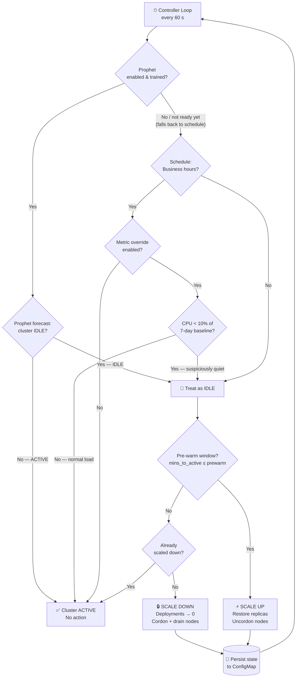
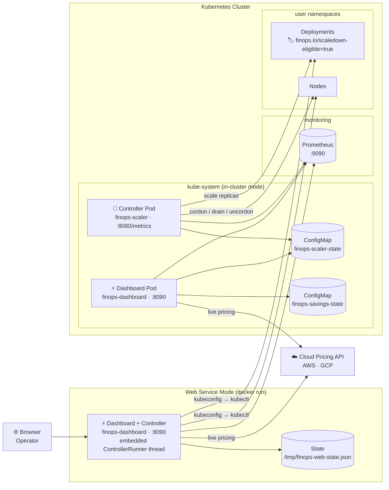
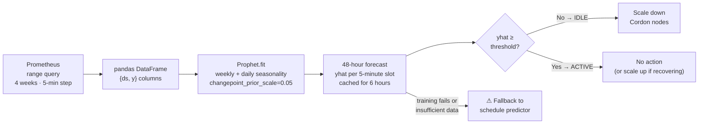
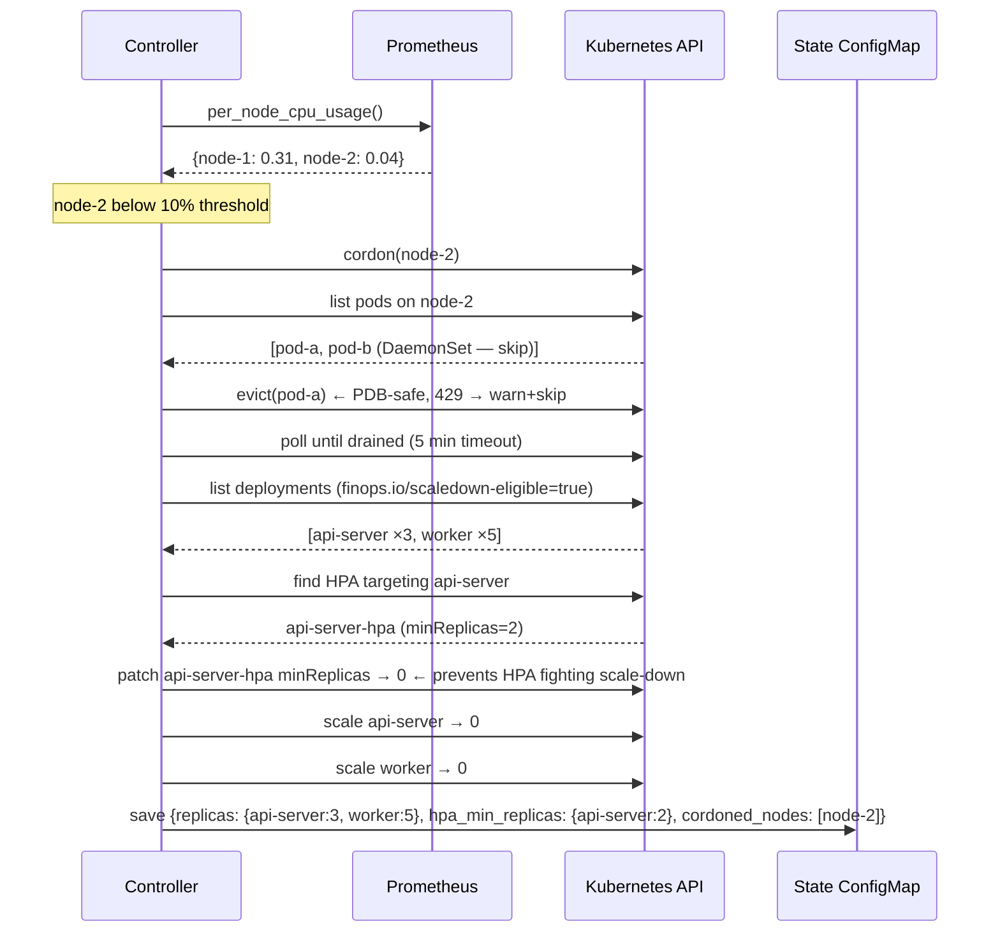
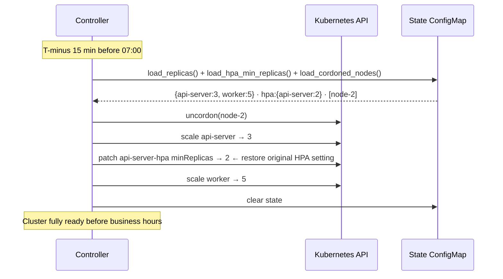
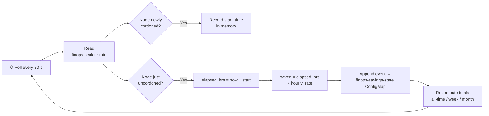
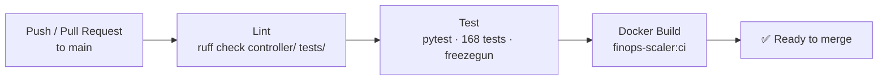
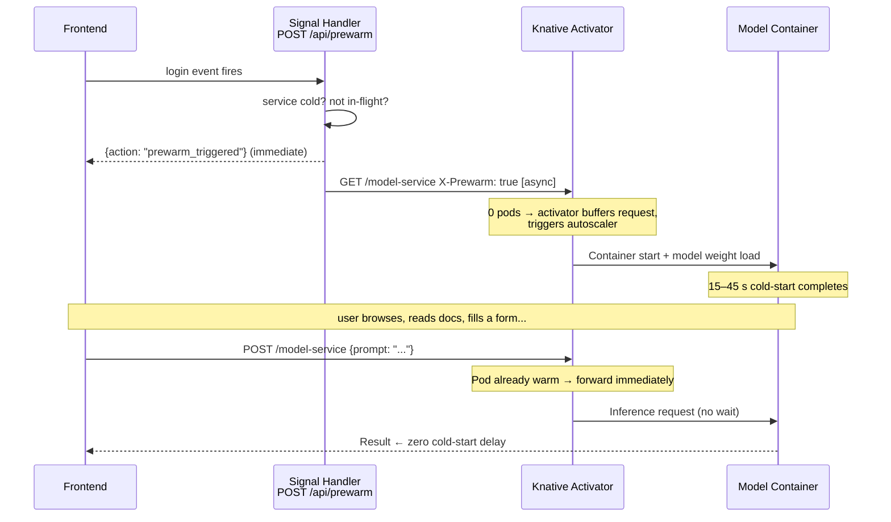

# Dynamic Predictive FinOps Cluster Down-Scaler

> **Automatically hibernate your Kubernetes cluster overnight and on weekends — then wake it back up before your team arrives.**


| | | |
|:---:|:---:|:---:|
| **Save up to 70% overnight** | **Zero-downtime scale-up** | **Configure from the browser** |
| Idle nodes cordoned, workloads scaled to zero during off-hours | Pre-warm fires 15 min before business hours — cluster ready on time | Live settings panel — no YAML or env vars needed |

---

## How It Works

- **⏰ Watches the clock** — Evaluates a configurable business-hours schedule (timezone-aware, Mon–Fri by default) every 60 seconds
- **🔮 Learns your patterns** *(optional)* — Facebook Prophet trains on weeks of Prometheus CPU data, forecasting 48 hours ahead; replaces the fixed schedule with learned idle/active predictions
- **📊 Reads Prometheus** — Optionally compares live CPU against a 7-day rolling baseline to catch quiet days mid-schedule
- **🔒 Cordons idle nodes + scales workloads to zero** — Only targets Deployments labelled `finops.io/scaledown-eligible=true`; PDB-safe eviction with 5-minute drain timeout
- **🌅 Pre-warms before business hours resume** — Uncordons nodes and restores saved replica counts `PREWARM_MINUTES` before the active window starts
- **💾 Survives restarts** — State (original replica counts, cordoned nodes) persisted in a Kubernetes ConfigMap
- **💰 Tracks every dollar saved** — Background task prices each cordon/uncordon cycle against live AWS/GCP rates
- **🧪 Demo mode** — Synthetic cluster simulation; runs locally with no Kubernetes, no Prometheus, no cloud account
- **⚡ Smart Pre-Warm Engine** *(optional)* — Listens for early user-intent signals (login, hover, input focus) and proactively boots Knative AI containers before the user submits a prompt, eliminating cold-start latency on high-conversion pages

---

## Decision Algorithm

Every tick the controller evaluates a three-layer gate and picks exactly one action:



---

## Scale-Down Decision Table

| Scenario | `low_activity` | `in_prewarm` | `scaled_down` | Action |
|:---------|:--------------:|:------------:|:-------------:|:-------|
| Idle window — first time | ✅ | ❌ | ❌ | **SCALE DOWN** |
| Already scaled down, staying idle | ✅ | ❌ | ✅ | — no-op |
| Pre-warm window approaching | ✅ | ✅ | ✅ | **SCALE UP** |
| Business hours resumed | ❌ | ❌ | ✅ | **SCALE UP** |
| Normal cluster operation | ❌ | ❌ | ❌ | — no-op |

---

## System Architecture

The system runs in two modes: **web service** (single Docker container outside the cluster) and **in-cluster** (controller + dashboard pods deployed via Helm or manifests).



---

## Prophet ML Forecasting



Prophet is **optional** — if the package is not installed or training fails for any reason, the controller falls back to the schedule predictor transparently.

---

## Scale-Down Sequence



---

## Pre-Warm Sequence



---

## Cost Savings Tracker



---

## CI/CD Pipeline



---

## Dashboard UI

Apple-dark infrastructure control panel. Stark black background, electric-blue (`#2997ff`) accents, Outfit + JetBrains Mono typography, 2px border-radius geometry, physics-based page-load stagger.

```
┌──────────────────────────────────────────────────────────────────────────────┐
│  FINOPS/SCALER                  [● ACTIVE]  [⟳ CTRL RUNNING]  14:32:05 ● ⚙  │
│  dynamic predictive down-scaler                                              │
├──── cluster utilisation hairline (1px, green→amber→red, animated width) ────┤
│ [DEMO] Running with synthetic data — no Kubernetes required.   Connect →  ×  │
├──────────────┬──────────────┬──────────────┬──────────────────────────────-─┤
│  $12,450     │  $2,100      │  $0.58/hr    │  2                              │
│  TOTAL SAVED │  THIS MONTH  │  RATE / HR   │  NODES CORDONED                 │
│  (green bar) │              │  (blue/accnt)│  (amber when >0)               │
├──────────────┴──────────────┴──────────────┴─────────────────────────────-──┤
│  NODE TOPOLOGY                                                               │
│                                                                              │
│  ┌────────────────────┐  ┌────────────────────┐  ┌────────────────────┐    │
│  │ demo-node-1        │  │ demo-node-2  ░░░░  │  │ demo-node-3  ░░░░  │    │
│  │ ─────────────────  │  │ ///////////////////│  │ ///////////////////│    │
│  │ ████████▒▒ 52%     │  │ ///////////////////│  │ ///////////////////│    │
│  │ 4.2 / 8.0 cores    │  │ 0.3 / 8.0 cores    │  │ 0.4 / 8.0 cores    │    │
│  │ [READY]            │  │ [CORDONED]         │  │ [CORDONED]         │    │
│  └────────────────────┘  └────────────────────┘  └────────────────────┘    │
│   ^─ green CPU bar         ^─ amber 2px border     diagonal amber hatch     │
│                              + diagonal hatch                                │
├──────────────────────────────────────────────────────────────────────────────┤
│  CPU DEMAND vs CAPACITY             [ 6h ][ 12h ][ 24h ][ 2d ][ 7d ]       │
│                                                                              │
│  cores ▲                                                                     │
│     16 │▓▓▓▓▓▓▓▓▓▓▓▓▓▓▓▓▓▓▓▓▓▓▓                                            │
│     12 │▓▓▓▓▓▓▓▓▓▓▓▓▓▓▓▓▓▓▓▓▓▓▓ ─ ─ ─ ─ capacity (dashed red)              │
│      8 │▓▓▓▓▓▓▓▓▓▓▓▓▓▓▓▓▓▓▓▓▓▓▓▓▓▓▓▓▓▓▓▓▓                                  │
│      0 └──────────────────────────────────────────────────────────► time   │
│                      ▼ scale-down              ▲ scale-up                   │
│  ← area: rgba(41,151,255,0.08), stroke: #2997ff, tick labels: JetBrains Mono│
├──────────────────────────────────────────────────────────────────────────────┤
│  AUDIT LOG                                                  32 events        │
│                                                                              │
│  NODE          CORDONED AT          RELEASED AT          DURATION  SAVED    │
│  demo-node-3   May 22, 19:00        May 23, 07:00          12.0h   $2.30    │
│  demo-node-2   May 22, 19:00        May 23, 07:00          12.0h   $2.30    │
│  …  (JetBrains Mono 11px, duration col in accent blue, saved col in green)  │
└──────────────────────────────────────────────────────────────────────────────┘
```

```
                        ⚙ Settings drawer (480px, slide-in from right)
┌─────────────────────────────────────────────────┐
│ Configuration  ●                              ×  │  ← amber dot = unsaved changes
├─────────────────────────────────────────────────┤
│ // CLUSTER                                       │
│   Status  ● Connected  cluster.example.com       │
│   Loop    ⟳ RUNNING               [ Stop ]      │
│   ┌──────────────────────────────────────────┐  │
│   │ apiVersion: v1                            │  │  ← JetBrains Mono textarea
│   │ clusters: [{server: https://…}]           │  │     paste kubeconfig here
│   └──────────────────────────────────────────┘  │
│                      [ Validate & Connect ]      │
├─────────────────────────────────────────────────┤
│ // CONN                                          │
│   Demo Mode              [  ●──]                │
│   Prometheus URL  [http://prometheus:9090    ]  │
├─────────────────────────────────────────────────┤
│ // CLOUD                                         │
│   Provider   [ Manual ][ AWS ][ GCP ]           │
│   Instance   [m5.xlarge            ]            │
│   $/hr       [0.192               ]            │
├─────────────────────────────────────────────────┤
│ // SCHED                                         │
│   Hours  [07:00] to [19:00]                     │
│   Days   [Mo][Tu][We][Th][Fr] Sa  Su            │
│   Zone   [America/New_York        ]            │
├─────────────────────────────────────────────────┤
│ // PRED                                          │
│   Metric Override         [●──  ]               │
│   Prophet ML Forecasting  [  ──●]               │
│  ┌ ─ ─ ─ ─ ─ ─ ─ ─ ─ ─ ─ ─ ─ ─ ─ ─ ─ ─ ─ ─ ┐ │
│    Training weeks [4]  Idle threshold [0.5]    │ │
│  └ ─ ─ ─ ─ ─ ─ ─ ─ ─ ─ ─ ─ ─ ─ ─ ─ ─ ─ ─ ─ ┘ │
├─────────────────────────────────────────────────┤
│ // UI                                            │
│   Poll interval  [30 s]  Util threshold [10%]   │
├─────────────────────────────────────────────────┤
│ [ Discard ]                 [ Save Changes ]    │
└─────────────────────────────────────────────────┘
```

---

## Use Cases

> [!NOTE]
> **Use Case 1 — Overnight & weekend cost savings (primary)**
>
> Friday 6 PM → schedule exits business hours → controller cordons 4 underutilised nodes, scales 8 deployments to zero, persists state.
> Monday 6:45 AM → pre-warm triggers 15 min early → nodes uncordoned, replicas restored, cluster fully ready by 7:00 AM.
>
> **60 hrs × 4 nodes × $0.192/hr ≈ $46 per weekend → ~$2,400/year on a single cluster.**

> [!TIP]
> **Use Case 2 — Bank holidays & quiet Tuesdays (metric override)**
>
> `ENABLE_METRIC_OVERRIDE=true` — on a public holiday, live cluster CPU drops to 2% of its 7-day average.
> The controller treats this as an idle window mid-schedule and scales down automatically — no operator intervention needed.

> [!TIP]
> **Use Case 3 — ML-learned patterns (Prophet mode)**
>
> `ENABLE_PROPHET=true` — after 4 weeks of history, Prophet learns that your cluster goes quiet every Friday afternoon, not at 19:00 exactly.
> Scale-down fires at the learned quiet point automatically, without any schedule adjustment.

> [!TIP]
> **Use Case 4 — Scoped to staging only (namespace filter)**
>
> `NAMESPACE_FILTER=staging` — production workloads are completely untouched.
> Only test/staging Deployments are eligible for scale-down, giving teams a safe trial with zero production risk.

> [!IMPORTANT]
> **Use Case 5 — Dry-run audit before go-live**
>
> `DRY_RUN=true` — all scale-down and cordon decisions are logged (`[DRY-RUN] Would cordon node-2`) but **zero Kubernetes mutations are made**.
> Run for a week to validate the schedule logic matches your team's expectations before going live.

> [!NOTE]
> **Use Case 6 — Cost accountability & reporting**
>
> `GET /api/savings` returns structured JSON:
> ```json
> { "total_saved_usd": 12450.32, "this_week_usd": 840.00,
>   "this_month_usd": 2100.00, "cloud_provider": "aws",
>   "instance_type": "m5.xlarge", "hourly_rate_per_node": 0.192 }
> ```
> Pipe into a weekly Slack/Teams digest, a Grafana annotation, or a FinOps dashboard.

---

## ⚡ Smart Pre-Warm Engine *(optional)*

> **For high-conversion AI feature pages only.** When a user logs in or navigates to an AI feature, the engine proactively boots the Knative model container before they submit a prompt — so they never wait for a cold start.

### The problem

Scaling serverless AI containers to zero saves money when traffic is idle, but the next user pays a cold-start penalty while the container boots and loads model weights (typically 15–60 seconds for large models). On a high-conversion page — an AI demo, a chat product, an inference feature users pay for — that delay is a drop-off event.

### How it works

Knative has no "pre-warm" API. It scales up in response to real HTTP traffic. The engine exploits this: it sends a lightweight HTTP request to the Knative service the moment an intent signal arrives from the frontend. By the time the user submits their prompt, the pod is already warm.



### Signal types

| Signal | Confidence | When to fire | Typical window to first prompt |
|:-------|:----------:|:-------------|:-------------------------------|
| `login` | 0.95 | User authenticates | 30–120 s |
| `input_focus` | 0.90 | User focuses the prompt input | 5–30 s |
| `page_load` | 0.65 | User navigates to the AI feature page | 20–60 s |
| `hover` | 0.50 | User hovers AI call-to-action ≥ 500 ms | 5–20 s |

The cold-start window must fit inside the signal-to-submit window. `login` is the safest signal; `hover` is riskier for slow cold-starts.

### When to enable

> [!IMPORTANT]
> **Enable when all three are true:**
> 1. Your model container cold-start is **> 10 seconds**
> 2. You have a **dedicated AI feature page** — users navigate there specifically to use the AI
> 3. There is a **predictable user journey** before the first prompt (login → navigate → type)
>
> **Do not enable** when cold-start is < 5 s, traffic is constant enough that pods never reach zero, or users arrive directly at the inference endpoint.

### Architecture

```
dashboard/backend/prewarm.py   ← PrewarmController
  ├─ warm cache    dict[service_url → expiry]   per-service warm state, 180 s TTL
  ├─ inflight set  set[service_url]              prevents duplicate in-flight pings
  └─ _ping()       async httpx GET              fires and forgets; marks warm on success

POST /api/prewarm              ← FastAPI route in app.py
  ├─ reads  config.enable_prewarm  (off by default)
  ├─ reads  body.service_url, body.signal, body.user_id
  └─ delegates to PrewarmController.handle_signal()
```

### Enabling

Toggle **⚙ Settings → Prediction → AI Pre-Warm Engine** in the dashboard UI, or set the environment variable:

```bash
ENABLE_PREWARM=true
```

### Wiring frontend signals

Add this snippet to the pages where you want pre-warming. It is fire-and-forget — failures are silently ignored so it never affects the user-facing flow:

```javascript
async function signalPrewarm(serviceUrl, signal = 'hover') {
  try {
    await fetch('/api/prewarm', {
      method: 'POST',
      headers: { 'Content-Type': 'application/json' },
      body: JSON.stringify({ service_url: serviceUrl, signal }),
    })
  } catch {} // non-critical — never let this break the page
}

// Hook into the events that predict AI usage on your page
document.querySelector('#login-btn').addEventListener('click', () =>
  signalPrewarm('http://model-api.default.svc.cluster.local', 'login'))

document.querySelector('#ai-feature-btn').addEventListener('mouseover', () =>
  signalPrewarm('http://model-api.default.svc.cluster.local', 'hover'))

document.querySelector('#prompt-input').addEventListener('focus', () =>
  signalPrewarm('http://model-api.default.svc.cluster.local', 'input_focus'))
```

If your model service handles the `X-Prewarm: true` header, it can skip inference and return 200 immediately — reducing the cost of the ping request. Without this, the pre-warm request runs a real inference, which still warms the pod correctly.

### Overhead analysis

| Concern | Reality |
|:--------|:--------|
| False positives (user signals but never submits) | Pod idles for ≤ 3 min then scales to zero. Cost: fractions of a cent per event. |
| Duplicate signals (same service, many users) | In-flight set prevents concurrent pings to the same URL. |
| Signal fires too late | Increase lead time: use `login` or `page_load` instead of `hover`. |
| Pod cools down before user submits | Raise Knative `scale-to-zero-grace-period`. The 180 s warm cache TTL is set conservatively. |

---

## Tech Stack

| Layer | Technology | Role |
|:------|:-----------|:-----|
| **Controller** | Python 3.12 | Main control loop — `_tick()` every 60 s |
| | `kubernetes` (official client) | Node cordon / drain / uncordon · Deployment scaling |
| | `prometheus-client` | Self-expose `finops_*` metrics on `:8080/metrics` |
| | `httpx` | Prometheus HTTP API (`/api/v1/query`, `/api/v1/query_range`) |
| | `pytz` | Timezone-aware schedule evaluation |
| | `prophet` + `pandas` *(optional)* | Time-series forecasting — train on Prometheus range data |
| | `auto_labeller.py` | Reads namespace annotations; patches Deployments with `finops.io/scaledown-eligible=true` each tick |
| | `autoscaling/v2` API | `find_hpa()` · `suspend_hpa()` (minReplicas→0) · `resume_hpa()` (restores saved value) |
| | `preflight.py` | Startup PASS/WARN/FAIL checks — schedule · Prometheus · node visibility · eligible deployments · Prophet install · HPA RBAC · state ConfigMap |
| | `k8s_events.py` | `K8sEventEmitter` — emits native K8s Events for scale/cordon transitions (non-fatal if RBAC missing) |
| | `webhook.py` | `WebhookNotifier` — Slack-compatible HTTP POST on scale-down/up; fire-and-forget, errors swallowed |
| | `leader_election.py` | `LeaderElector` — `coordination.k8s.io/v1` Lease; blocks non-leaders, steals expired leases |
| **Controller demo** | `demo_stub.py` | DemoPrometheusClient · DemoStateStore · DemoCoreV1Api · DemoAppsV1Api · DemoAutoscalingV2Api · DemoCoordinationV1Api — synthetic data, no K8s |
| **Dashboard Backend** | FastAPI + uvicorn | REST API (15 routes) + React static file serving |
| | `cloud_providers.py` | `list_eks_clusters` · `kubeconfig_from_eks` · `get_eks_token` (STS presigned URL, `k8s-aws-v1.*`) · `list_gke_clusters` · `kubeconfig_from_gke` — native EKS/GKE discovery without kubectl |
| | `controller_runner.py` | `ControllerRunner` — daemon thread with embedded scale/cordon logic; stores cloud credentials for EKS STS token auto-refresh every 13 min |
| | `auth.py` | Per-request `Authorization: Bearer <token>` middleware; reads `API_TOKEN` each call |
| | `config_store.py` | Mutable `DashboardConfig` — hot-patchable via `PATCH /api/config`, no restart |
| | `demo_stub.py` | DemoK8sReader + synthetic Prometheus responses for all endpoints |
| | `boto3` | AWS EKS cluster listing + IAM STS presigned token generation + EC2 Pricing API |
| | `google-cloud-container` | GKE cluster listing (`ClusterManagerClient`) |
| | `google-auth[requests]` | GCP OAuth2 service account token generation + refresh |
| | `pyyaml` | Kubeconfig YAML parsing and generation |
| | `asyncio` | Background savings-tracker coroutine |
| **Dashboard Frontend** | React 18 + TypeScript | Apple-dark infrastructure control panel SPA |
| | Outfit + JetBrains Mono | Google Fonts — Outfit 800 for KPI numerics; JetBrains Mono for node names, timestamps, monospaced inputs |
| | `MetricsBar.tsx` | 4-tile animated KPI bar — Total Saved · This Month · Rate/hr · Nodes Cordoned |
| | `NodeTopology.tsx` | SVG node grid — per-node CPU bars, diagonal amber hatch for cordoned nodes, hover tooltip, responsive column layout via ResizeObserver (1–5 cols) |
| | `useAnimatedValue.ts` | rAF-based cubic easing hook — smooth number transitions for KPI tiles |
| | Recharts | ComposedChart — area (CPU used, `#2997ff`) + capacity line (dashed red) + event markers |
| | `ClusterPage.tsx` | Cluster Connection page — hero provider selector (Kubeconfig/EKS/GKE), large provider cards, credentials drawer, schedule + data source + controller config lower grid |
| | `ConnectPanel.tsx` | Header drawer — connection method only (provider pills + credentials form) |
| | `SettingsPanel.tsx` | Slide-in fine-tuning drawer (// PRED · // UI) |
| | `AuditLog.tsx` | Reverse-chronological cordon event table — JetBrains Mono cells, accent blue duration, green savings |
| | `DemoBanner.tsx` | First-run hint — opens Settings, dismissible per-session |
| **Pre-Warm Engine** | `prewarm.py` | `PrewarmController` — warm cache, in-flight dedup, async Knative ping |
| | `POST /api/prewarm` | Signal endpoint — accepts login/hover/focus events, fires pre-warm if cold |
| | Vite | Build tooling + `/api` proxy for local dev |
| **Persistence** | Kubernetes ConfigMap | `finops-scaler-state` + `finops-savings-state` — survive pod restarts |
| **Observability** | Prometheus metrics | Counters & gauges: scale events, nodes cordoned, replicas saved, errors |
| **Packaging** | Helm chart | Fully parameterised install with `values.yaml` |
| | `docker-compose.yml` | Demo mode default; `--profile full` adds controller |
| | Multi-stage Dockerfile | Node 20-alpine builds React → Python 3.12-slim serves it |
| | `Makefile` | `make demo` · `make dev` · `make test` · `make build` |
| **CI** | GitHub Actions | `ruff` lint → `pytest` (168 tests) → Docker build |
| **Testing** | pytest + freezegun + pytest-mock | Time-frozen schedule tests + K8s API mocks |

---

## Configuration Reference

### Schedule

| Variable | Default | Description |
|:---------|:--------|:------------|
| `BUSINESS_HOURS_START` | `07:00` | Active window start (HH:MM, 24-hour) |
| `BUSINESS_HOURS_END` | `19:00` | Active window end (HH:MM, 24-hour) |
| `BUSINESS_DAYS` | `0,1,2,3,4` | Active days — 0=Mon … 6=Sun |
| `TIMEZONE` | `UTC` | IANA timezone (e.g. `America/New_York`) |
| `PREWARM_MINUTES` | `15` | Lead time — scale up this many minutes before window start |

### Scaling

| Variable | Default | Description |
|:---------|:--------|:------------|
| `MIN_REPLICA_FLOOR` | `0` | Minimum replicas during scale-down |
| `NODE_UTILISATION_THRESHOLD` | `0.10` | Cordon nodes below this CPU fraction (10%) |
| `NAMESPACE_FILTER` | *(all)* | Restrict eligible Deployments to one namespace |
| `ENABLE_METRIC_OVERRIDE` | `false` | Quiet-day detection via Prometheus CPU baseline |
| `ENABLE_HPA_SUSPEND` | `true` | Patch HPA `minReplicas: 0` on scale-down; restores original value on scale-up |
| `ENABLE_AUTO_LABEL` | `false` | Auto-label Deployments in namespaces annotated `finops.io/scaledown-namespace=true` |
| `ENABLE_K8S_EVENTS` | `true` | Emit native K8s Events for every scale/cordon transition |
| `WEBHOOK_URL` | *(empty)* | Slack-compatible endpoint to notify on scale-down / scale-up; leave empty to disable |
| `CLUSTER_NAME` | *(empty)* | Identifier included in webhook payloads |
| `ENABLE_LEADER_ELECTION` | `true` | Coordinate multiple replicas via `coordination.k8s.io/v1` Lease |
| `LEADER_LEASE_DURATION` | `30` | Lease validity window in seconds |
| `ENABLE_PREFLIGHT` | `true` | Run PASS/WARN/FAIL startup checks before entering the control loop |

### Operations

| Variable | Default | Description |
|:---------|:--------|:------------|
| `DRY_RUN` | `false` | Log all mutations, apply none |
| `DEMO_MODE` | `false` | Synthetic data — no cluster or Prometheus needed |
| `LOOP_INTERVAL_SECONDS` | `60` | Controller poll cadence |
| `METRICS_PORT` | `8080` | Prometheus scrape port |
| `PROMETHEUS_URL` | `http://prometheus:9090` | Prometheus base URL |

### Prophet

| Variable | Default | Description |
|:---------|:--------|:------------|
| `ENABLE_PROPHET` | `false` | Activate ML forecasting |
| `PROPHET_TRAINING_WEEKS` | `4` | Weeks of Prometheus history to train on |
| `PROPHET_IDLE_THRESHOLD_CORES` | `0.5` | yhat below this → cluster is idle |
| `PROPHET_RETRAIN_HOURS` | `6` | Model refresh interval |

### Dashboard / Pricing

| Variable | Default | Description |
|:---------|:--------|:------------|
| `CLOUD_PROVIDER` | `manual` | `aws` · `gcp` · `manual` |
| `NODE_INSTANCE_TYPE` | — | e.g. `m5.xlarge`, `n2-standard-4` |
| `AWS_REGION` | — | e.g. `us-east-1` |
| `NODE_HOURLY_COST` | `0.192` | Fallback rate (USD/hr) when pricing API unavailable |

> All dashboard settings can also be changed live via **⚙ Settings** in the UI — no restart needed.

---

## Prometheus Metrics Exposed

The controller self-exposes metrics at `:8080/metrics` (Prometheus scrape-ready):

| Metric | Type | Description |
|:-------|:-----|:------------|
| `finops_scaledown_events_total` | Counter | Scale-down cycles completed |
| `finops_scaleup_events_total` | Counter | Scale-up cycles completed |
| `finops_deployments_scaled_total` | Counter | Deployments scaled (labelled by `namespace`) |
| `finops_nodes_cordoned` | Gauge | Currently cordoned node count |
| `finops_replicas_saved` | Gauge | Total replicas held in state store |
| `finops_controller_errors_total` | Counter | Unhandled exceptions in main loop |

---

## Project Layout

```
DynaPredictingDownScaler/
├── controller/
│   ├── main.py              # Control loop · _tick() · scale-down/up helpers
│   ├── predictor.py         # Schedule + metric-override + Prophet gate
│   ├── prophet_predictor.py # ProphetPredictor — train, forecast 48 h, cache
│   ├── scaler.py            # Deployment replica mgmt + HPA suspend/resume
│   ├── auto_labeller.py     # Namespace-annotation-driven deployment labeller
│   ├── node_manager.py      # Node cordon · drain · uncordon
│   ├── state_store.py       # ConfigMap persistence (replicas · nodes · HPA state)
│   ├── metrics.py           # Prometheus HTTP client (query + query_range)
│   ├── telemetry.py         # Self-expose finops_* metrics on :8080/metrics
│   ├── config.py            # Env-var backed Config dataclass (all features)
│   ├── preflight.py         # Startup PASS/WARN/FAIL validation checks
│   ├── k8s_events.py        # Native K8s Event emitter (scale/cordon transitions)
│   ├── webhook.py           # Slack-compatible HTTP POST notifier
│   ├── leader_election.py   # coordination.k8s.io/v1 Lease leader election
│   └── demo_stub.py         # Synthetic K8s + Prometheus stubs for DEMO_MODE
├── dashboard/
│   ├── backend/
│   │   ├── app.py              # FastAPI · 15 routes (connect, connect/eks, connect/gke, aws/clusters, gcp/clusters, controller, config, events, status, capacity, history, savings, prewarm, health)
│   │   ├── auth.py             # Bearer-token middleware (API_TOKEN)
│   │   ├── cloud_providers.py  # EKS/GKE cluster discovery · kubeconfig generation · STS token
│   │   ├── config_store.py     # Hot-patchable DashboardConfig singleton
│   │   ├── controller_runner.py# ControllerRunner daemon thread + EKS STS token refresh thread
│   │   ├── demo_stub.py        # DemoK8sReader + synthetic Prometheus responses
│   │   ├── prewarm.py          # PrewarmController — warm cache + Knative ping (optional)
│   │   ├── k8s_client.py       # Read state + savings ConfigMaps · list nodes
│   │   ├── savings_tracker.py  # Async cordon-transition cost accumulator
│   │   └── pricing.py          # AWS / GCP / manual pricing with 1-hour cache
│   ├── frontend/src/
│   │   ├── App.tsx                     # Polling · layout · cluster-util hairline vars
│   │   ├── api.ts                      # Typed fetch helpers + all interface types
│   │   ├── hooks/
│   │   │   └── useAnimatedValue.ts     # rAF cubic easing for animated KPI numbers
│   │   └── components/
│   │       ├── MetricsBar.tsx          # 4-tile KPI bar (saved/month/rate/cordoned)
│   │       ├── NodeTopology.tsx        # Physics-based SVG force graph — CPU arcs, glow, drag-to-rearrange
│   │       ├── DemandCapacityChart.tsx # Recharts ComposedChart + event markers
│   │       ├── AuditLog.tsx            # Cordon event history table (reverse-chron)
│   │       ├── ClusterPage.tsx         # Cluster Connection page — hero connect, provider cards, creds drawer
│   │       ├── ConnectCard.tsx         # Inline connect card (shown via demo banner)
│   │       ├── ConnectPanel.tsx        # Header drawer — connection method only (no schedule)
│   │       ├── DashboardConfig.tsx     # Controller dashboard — schedule section + save bar
│   │       ├── DemoBanner.tsx          # First-run "demo mode" hint → opens Cluster page
│   │       ├── SettingsPanel.tsx       # Slide-in fine-tuning drawer (prediction, UI)
│   │       └── Toggle.tsx              # Animated accessible toggle switch
│   └── Dockerfile               # Node 20-alpine builds React → Python 3.12-slim serves
├── helm/finops-scaler/          # Helm chart (values.yaml + 6 templates)
├── manifests/                   # Raw Kubernetes YAML (controller + dashboard)
├── tests/                       # 168 pytest tests · freezegun · pytest-mock
├── scripts/
│   ├── dev.sh                   # One-command hot-reload dev (macOS/Linux)
│   └── dev.ps1                  # One-command hot-reload dev (Windows)
├── docker-compose.yml           # Demo mode default · 'full' profile adds controller
├── Makefile                     # make demo · dev · build · test · stop · logs · clean
├── .env.example                 # Annotated env var template → copy to .env
├── requirements.txt             # Controller dependencies
├── requirements-prophet.txt     # Optional: prophet + pandas
├── requirements-dev.txt         # Test dependencies (pytest, freezegun, pytest-mock)
└── .github/workflows/ci.yml     # Lint → Test → Docker build
```
