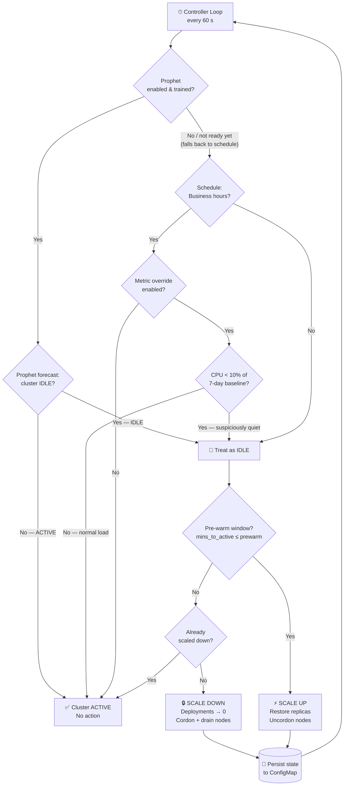
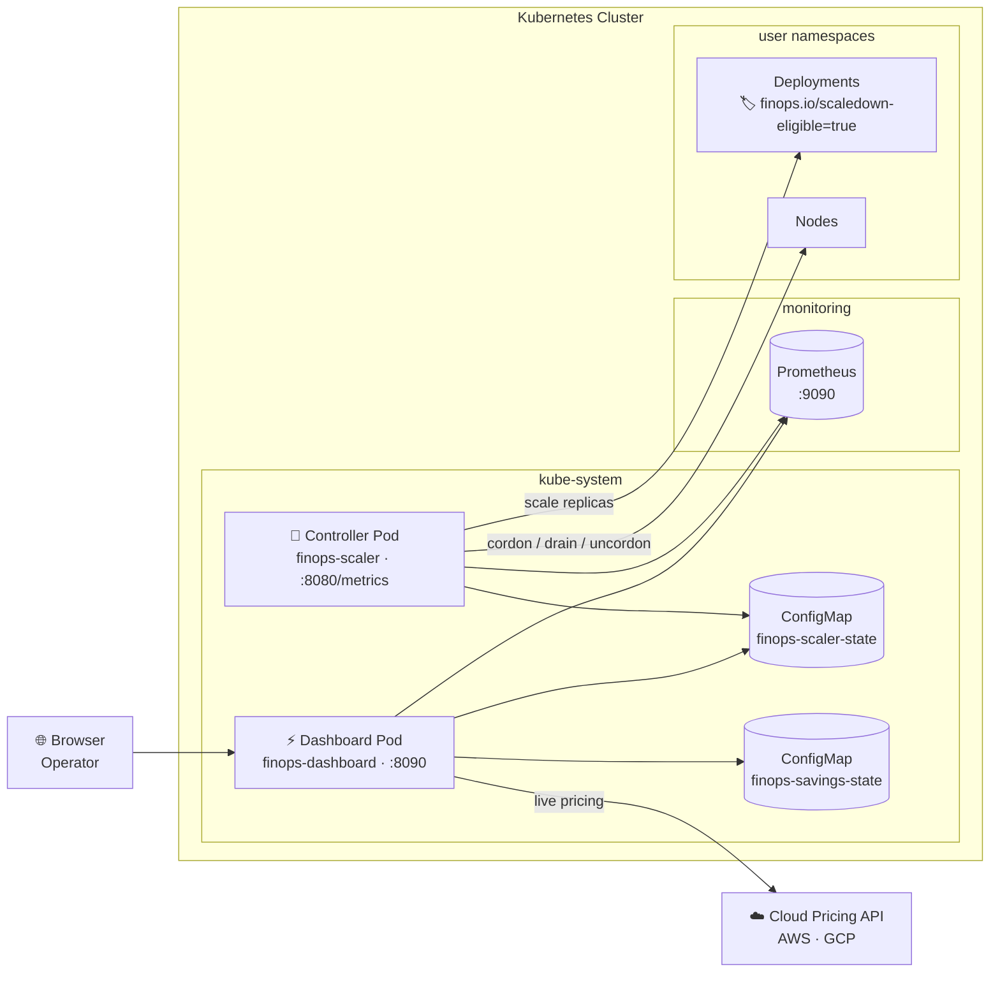
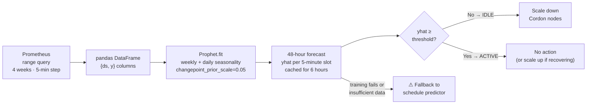
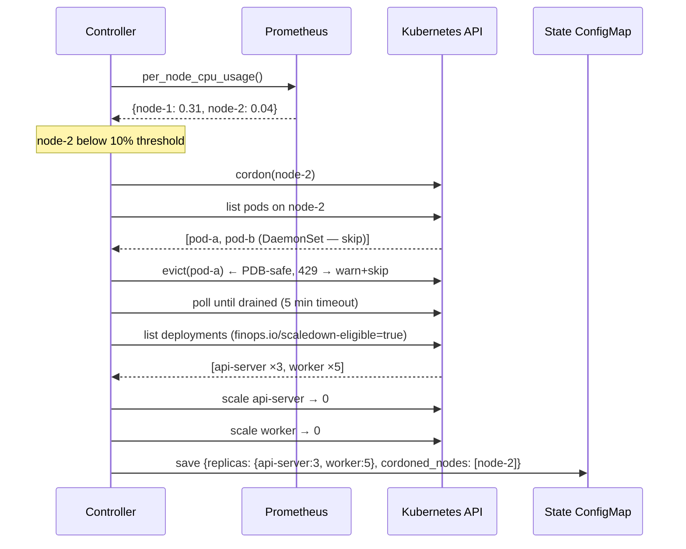
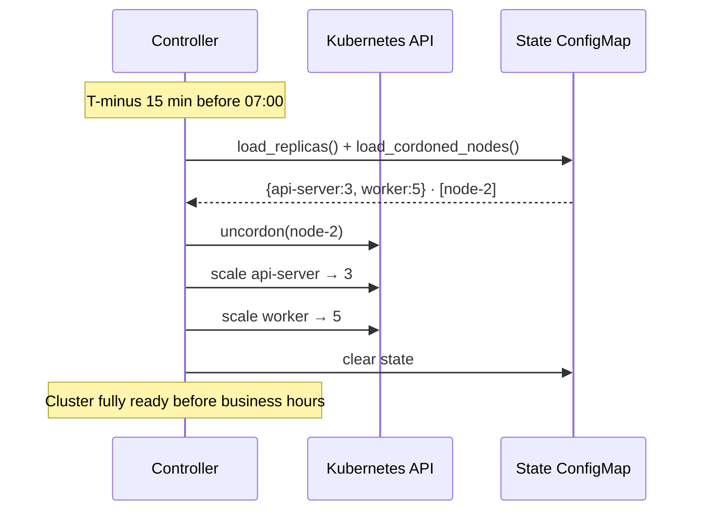
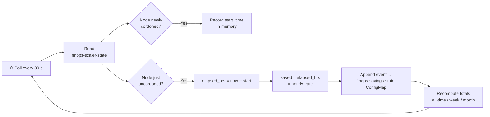
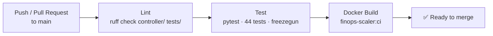

# Dynamic Predictive FinOps Cluster Down-Scaler

> **Automatically hibernate your Kubernetes cluster overnight and on weekends — then wake it back up before your team arrives.**


| | | |
|:---:|:---:|:---:|
| **Save up to 70% overnight** | **Zero-downtime scale-up** | **Configure from the browser** |
| Idle nodes cordoned, workloads scaled to zero during off-hours | Pre-warm fires 15 min before business hours — cluster ready on time | Live settings panel — no YAML or env vars needed |

---

## How It Works

- **⏰ Watches the clock** — Evaluates a configurable business-hours schedule (timezone-aware, Mon–Fri by default) every 60 seconds
- **🔮 Learns your patterns** *(optional)* — Facebook Prophet trains on weeks of Prometheus CPU data, forecasting 48 hours ahead; replaces the fixed schedule with learned idle/active predictions
- **📊 Reads Prometheus** — Optionally compares live CPU against a 7-day rolling baseline to catch quiet days mid-schedule
- **🔒 Cordons idle nodes + scales workloads to zero** — Only targets Deployments labelled `finops.io/scaledown-eligible=true`; PDB-safe eviction with 5-minute drain timeout
- **🌅 Pre-warms before business hours resume** — Uncordons nodes and restores saved replica counts `PREWARM_MINUTES` before the active window starts
- **💾 Survives restarts** — State (original replica counts, cordoned nodes) persisted in a Kubernetes ConfigMap
- **💰 Tracks every dollar saved** — Background task prices each cordon/uncordon cycle against live AWS/GCP rates
- **🧪 Demo mode** — Synthetic cluster simulation; runs locally with no Kubernetes, no Prometheus, no cloud account

---

## Decision Algorithm

Every tick the controller evaluates a three-layer gate and picks exactly one action:



---

## Scale-Down Decision Table

| Scenario | `low_activity` | `in_prewarm` | `scaled_down` | Action |
|:---------|:--------------:|:------------:|:-------------:|:-------|
| Idle window — first time | ✅ | ❌ | ❌ | **SCALE DOWN** |
| Already scaled down, staying idle | ✅ | ❌ | ✅ | — no-op |
| Pre-warm window approaching | ✅ | ✅ | ✅ | **SCALE UP** |
| Business hours resumed | ❌ | ❌ | ✅ | **SCALE UP** |
| Normal cluster operation | ❌ | ❌ | ❌ | — no-op |

---

## System Architecture



---

## Prophet ML Forecasting



Prophet is **optional** — if the package is not installed or training fails for any reason, the controller falls back to the schedule predictor transparently.

---

## Scale-Down Sequence



---

## Pre-Warm Sequence



---

## Cost Savings Tracker



---

## CI/CD Pipeline



---

## Dashboard UI

```
┌──────────────────────────────────────────────────────────────────────────────┐
│  FinOps Down-Scaler                        Updated 14:32  ● Live  ⚙ Settings │
├─────────────────────────────────────────────────────────────────────────────-┤
│ 🧪 Running with synthetic demo data — no Kubernetes required.  Connect →  ×  │
├───────────────────────┬──────────────────────────────────────────────────────┤
│  CLUSTER STATUS       │  COST SAVINGS                                        │
│                       │                                                      │
│  ● IDLE               │          $12,450.32   all time                       │
│                       │                                                      │
│  Scaled down   Yes    │    $840.00  this week    $2,100.00  month            │
│  Cordoned      2      │                                                      │
│  Deployments   4      │    3 nodes currently cordoned                        │
│                       │    AWS  m5.xlarge @ $0.192/hr  us-east-1            │
│  [node-2] [node-3]    │    + $1.15 accruing                                 │
│  [api-server ×3]      │                                                      │
│  [worker ×5]          │                                                      │
├───────────────────────┴──────────────────────────────────────────────────────┤
│  CPU DEMAND vs CAPACITY                 [ 6h ][ 12h ][ 24h ][ 2d ][ 7d ]   │
│                                                                              │
│  cores ▲                                                                     │
│     16 │▓▓▓▓▓▓▓▓▓▓▓▓▓▓▓▓▓▓▓▓▓▓▓                                             │
│     12 │▓▓▓▓▓▓▓▓▓▓▓▓▓▓▓▓▓▓▓▓▓▓▓▓▓▓▓▓ ─ ─ ─ ─ capacity                      │
│      8 │▓▓▓▓▓▓▓▓▓▓▓▓▓▓▓▓▓▓▓▓▓▓▓▓▓▓▓▓▓▓▓▓▓▓▓▓▓▓▓                             │
│      0 └──────────────────────────────────────────────────────────► time    │
│                      ▼ scale-down                  ▲ scale-up               │
├──────────────────────────────────────────────────────────────────────────────┤
│  NODE DETAILS   (cluster: 4.9 / 24 cores · 20% utilised)                    │
│                                                                              │
│  Node     CPU Usage              Alloc    Util   Status      Savings         │
│  node-1   ████████░░  4.2 cores  8 cores  52%   ● Ready      —             │
│  node-2   ██░░░░░░░░  0.3 cores  8 cores   4%   ● Cordoned  $0.19/hr       │
│  node-3   ██░░░░░░░░  0.4 cores  8 cores   5%   ● Cordoned  $0.19/hr       │
└──────────────────────────────────────────────────────────────────────────────┘
```

```
                              ⚙ Settings drawer (slide-in)
┌─────────────────────────────────────────────────┐
│ Configuration  ●                              ×  │  ← amber dot = unsaved changes
├─────────────────────────────────────────────────┤
│ 🔌 CONNECTION                                    │
│   Demo Mode              [  ●──]                │  ← toggle off → connect real cluster
│   Prometheus URL  [http://prometheus:9090    ]  │
├─────────────────────────────────────────────────┤
│ ☁️ CLOUD & PRICING                               │
│   Provider   [ Manual ][ AWS ][ GCP ]           │  ← segmented control
│   Instance   [m5.xlarge            ]            │
│   Region     [us-east-1            ]            │
│   $/hr       [0.192               ]            │
├─────────────────────────────────────────────────┤
│ 🗓 SCHEDULE                      controller ref  │
│   Hours  [07:00] to [19:00]                     │
│   Days   [Mo][Tu][We][Th][Fr] Sa  Su            │  ← pill buttons
│   Zone   [America/New_York        ]            │
├─────────────────────────────────────────────────┤
│ 🔮 PREDICTION                                    │
│   Metric Override         [●──  ]               │
│   Prophet ML Forecasting  [  ──●]               │  ← toggle on reveals sub-fields
│  ┌──────────────────────────────────────────┐   │
│  │ Training weeks  [4]                       │   │
│  │ Idle threshold  [0.5 cores]               │   │
│  │ Retrain every   [6 hours]                 │   │
│  └──────────────────────────────────────────┘   │
├─────────────────────────────────────────────────┤
│ 📊 DASHBOARD                                     │
│   Poll interval  [30 seconds]                   │
│   Util threshold [0.10]                         │
├─────────────────────────────────────────────────┤
│ [ Discard ]                 [ Save Changes ]    │
└─────────────────────────────────────────────────┘
```

---

## Use Cases

> [!NOTE]
> **Use Case 1 — Overnight & weekend cost savings (primary)**
>
> Friday 6 PM → schedule exits business hours → controller cordons 4 underutilised nodes, scales 8 deployments to zero, persists state.
> Monday 6:45 AM → pre-warm triggers 15 min early → nodes uncordoned, replicas restored, cluster fully ready by 7:00 AM.
>
> **60 hrs × 4 nodes × $0.192/hr ≈ $46 per weekend → ~$2,400/year on a single cluster.**

> [!TIP]
> **Use Case 2 — Bank holidays & quiet Tuesdays (metric override)**
>
> `ENABLE_METRIC_OVERRIDE=true` — on a public holiday, live cluster CPU drops to 2% of its 7-day average.
> The controller treats this as an idle window mid-schedule and scales down automatically — no operator intervention needed.

> [!TIP]
> **Use Case 3 — ML-learned patterns (Prophet mode)**
>
> `ENABLE_PROPHET=true` — after 4 weeks of history, Prophet learns that your cluster goes quiet every Friday afternoon, not at 19:00 exactly.
> Scale-down fires at the learned quiet point automatically, without any schedule adjustment.

> [!TIP]
> **Use Case 4 — Scoped to staging only (namespace filter)**
>
> `NAMESPACE_FILTER=staging` — production workloads are completely untouched.
> Only test/staging Deployments are eligible for scale-down, giving teams a safe trial with zero production risk.

> [!IMPORTANT]
> **Use Case 5 — Dry-run audit before go-live**
>
> `DRY_RUN=true` — all scale-down and cordon decisions are logged (`[DRY-RUN] Would cordon node-2`) but **zero Kubernetes mutations are made**.
> Run for a week to validate the schedule logic matches your team's expectations before going live.

> [!NOTE]
> **Use Case 6 — Cost accountability & reporting**
>
> `GET /api/savings` returns structured JSON:
> ```json
> { "total_saved_usd": 12450.32, "this_week_usd": 840.00,
>   "this_month_usd": 2100.00, "cloud_provider": "aws",
>   "instance_type": "m5.xlarge", "hourly_rate_per_node": 0.192 }
> ```
> Pipe into a weekly Slack/Teams digest, a Grafana annotation, or a FinOps dashboard.

---

## Tech Stack

| Layer | Technology | Role |
|:------|:-----------|:-----|
| **Controller** | Python 3.12 | Main control loop — `_tick()` every 60 s |
| | `kubernetes` (official client) | Node cordon / drain / uncordon · Deployment scaling |
| | `prometheus-client` | Self-expose `finops_*` metrics on `:8080/metrics` |
| | `httpx` | Prometheus HTTP API (`/api/v1/query`, `/api/v1/query_range`) |
| | `pytz` | Timezone-aware schedule evaluation |
| | `prophet` + `pandas` *(optional)* | Time-series forecasting — train on Prometheus range data |
| **Controller demo** | `demo_stub.py` | DemoPrometheusClient · DemoStateStore · DemoCoreV1Api · DemoAppsV1Api — synthetic data, no K8s |
| **Dashboard Backend** | FastAPI + uvicorn | REST API + React static file serving |
| | `config_store.py` | Mutable `DashboardConfig` — hot-patchable via `PATCH /api/config`, no restart |
| | `demo_stub.py` | DemoK8sReader + synthetic Prometheus responses for all four endpoints |
| | `boto3` | AWS EC2 Pricing API (On-Demand Linux rates) |
| | `google-cloud-billing` | GCP Cloud Billing Catalog SKU lookup |
| | `asyncio` | Background savings-tracker coroutine |
| **Dashboard Frontend** | React 18 + TypeScript | Single-page application |
| | Recharts | ComposedChart — area (CPU used) + line (capacity) + event markers |
| | `SettingsPanel.tsx` | Slide-in drawer — 5 sections, save via `PATCH /api/config`, toast feedback |
| | `DemoBanner.tsx` | First-run hint — opens Settings, dismissible per-session |
| | Vite | Build tooling + `/api` proxy for local dev |
| **Persistence** | Kubernetes ConfigMap | `finops-scaler-state` + `finops-savings-state` — survive pod restarts |
| **Observability** | Prometheus metrics | Counters & gauges: scale events, nodes cordoned, replicas saved, errors |
| **Packaging** | Helm chart | Fully parameterised install with `values.yaml` |
| | `docker-compose.yml` | Demo mode default; `--profile full` adds controller |
| | Multi-stage Dockerfile | Node 20-alpine builds React → Python 3.12-slim serves it |
| | `Makefile` | `make demo` · `make dev` · `make test` · `make build` |
| **CI** | GitHub Actions | `ruff` lint → `pytest` (44 tests) → Docker build |
| **Testing** | pytest + freezegun + pytest-mock | Time-frozen schedule tests + K8s API mocks |

---

## Configuration Reference

### Schedule

| Variable | Default | Description |
|:---------|:--------|:------------|
| `BUSINESS_HOURS_START` | `07:00` | Active window start (HH:MM, 24-hour) |
| `BUSINESS_HOURS_END` | `19:00` | Active window end (HH:MM, 24-hour) |
| `BUSINESS_DAYS` | `0,1,2,3,4` | Active days — 0=Mon … 6=Sun |
| `TIMEZONE` | `UTC` | IANA timezone (e.g. `America/New_York`) |
| `PREWARM_MINUTES` | `15` | Lead time — scale up this many minutes before window start |

### Scaling

| Variable | Default | Description |
|:---------|:--------|:------------|
| `MIN_REPLICA_FLOOR` | `0` | Minimum replicas during scale-down |
| `NODE_UTILISATION_THRESHOLD` | `0.10` | Cordon nodes below this CPU fraction (10%) |
| `NAMESPACE_FILTER` | *(all)* | Restrict eligible Deployments to one namespace |
| `ENABLE_METRIC_OVERRIDE` | `false` | Quiet-day detection via Prometheus CPU baseline |

### Operations

| Variable | Default | Description |
|:---------|:--------|:------------|
| `DRY_RUN` | `false` | Log all mutations, apply none |
| `DEMO_MODE` | `false` | Synthetic data — no cluster or Prometheus needed |
| `LOOP_INTERVAL_SECONDS` | `60` | Controller poll cadence |
| `METRICS_PORT` | `8080` | Prometheus scrape port |
| `PROMETHEUS_URL` | `http://prometheus:9090` | Prometheus base URL |

### Prophet

| Variable | Default | Description |
|:---------|:--------|:------------|
| `ENABLE_PROPHET` | `false` | Activate ML forecasting |
| `PROPHET_TRAINING_WEEKS` | `4` | Weeks of Prometheus history to train on |
| `PROPHET_IDLE_THRESHOLD_CORES` | `0.5` | yhat below this → cluster is idle |
| `PROPHET_RETRAIN_HOURS` | `6` | Model refresh interval |

### Dashboard / Pricing

| Variable | Default | Description |
|:---------|:--------|:------------|
| `CLOUD_PROVIDER` | `manual` | `aws` · `gcp` · `manual` |
| `NODE_INSTANCE_TYPE` | — | e.g. `m5.xlarge`, `n2-standard-4` |
| `AWS_REGION` | — | e.g. `us-east-1` |
| `NODE_HOURLY_COST` | `0.192` | Fallback rate (USD/hr) when pricing API unavailable |

> All dashboard settings can also be changed live via **⚙ Settings** in the UI — no restart needed.

---

## Prometheus Metrics Exposed

The controller self-exposes metrics at `:8080/metrics` (Prometheus scrape-ready):

| Metric | Type | Description |
|:-------|:-----|:------------|
| `finops_scaledown_events_total` | Counter | Scale-down cycles completed |
| `finops_scaleup_events_total` | Counter | Scale-up cycles completed |
| `finops_deployments_scaled_total` | Counter | Deployments scaled (labelled by `namespace`) |
| `finops_nodes_cordoned` | Gauge | Currently cordoned node count |
| `finops_replicas_saved` | Gauge | Total replicas held in state store |
| `finops_controller_errors_total` | Counter | Unhandled exceptions in main loop |

---

## Project Layout

```
DynaPredictingDownScaler/
├── controller/
│   ├── main.py              # Control loop · _tick() · scale-down/up helpers
│   ├── predictor.py         # Schedule + metric-override + Prophet gate
│   ├── prophet_predictor.py # ProphetPredictor — train, forecast 48 h, cache
│   ├── scaler.py            # Deployment replica management
│   ├── node_manager.py      # Node cordon · drain · uncordon
│   ├── state_store.py       # ConfigMap persistence layer
│   ├── metrics.py           # Prometheus HTTP client (query + query_range)
│   ├── telemetry.py         # Self-expose finops_* metrics on :8080/metrics
│   ├── config.py            # Env-var backed Config dataclass (+ Prophet fields)
│   └── demo_stub.py         # Synthetic K8s + Prometheus stubs for DEMO_MODE
├── dashboard/
│   ├── backend/
│   │   ├── app.py             # FastAPI · GET/PATCH /api/config + 4 data routes
│   │   ├── config_store.py    # Hot-patchable DashboardConfig singleton
│   │   ├── demo_stub.py       # DemoK8sReader + synthetic Prometheus responses
│   │   ├── k8s_client.py      # Read state + savings ConfigMaps · list nodes
│   │   ├── savings_tracker.py # Async cordon-transition cost accumulator
│   │   └── pricing.py         # AWS / GCP / manual pricing with 1-hour cache
│   ├── frontend/src/
│   │   ├── App.tsx                     # Polling · settings state · demo banner
│   │   ├── api.ts                      # Typed fetch helpers + ConfigData interface
│   │   └── components/
│   │       ├── DemoBanner.tsx          # First-run "demo mode" hint → opens Settings
│   │       ├── SettingsPanel.tsx       # Slide-in config drawer (5 sections)
│   │       ├── Toggle.tsx              # Animated accessible toggle switch
│   │       ├── StatusPanel.tsx         # Mode badge · node/deployment chips
│   │       ├── DollarsSavedPanel.tsx   # Animated $ counter · provider badge
│   │       ├── DemandCapacityChart.tsx # Recharts ComposedChart + event markers
│   │       └── NodeTable.tsx           # Per-node CPU bars · savings column
│   └── Dockerfile               # Node 20-alpine builds React → Python 3.12-slim serves
├── helm/finops-scaler/          # Helm chart (values.yaml + 6 templates)
├── manifests/                   # Raw Kubernetes YAML (controller + dashboard)
├── tests/                       # 44 pytest tests · freezegun · pytest-mock
├── scripts/
│   ├── dev.sh                   # One-command hot-reload dev (macOS/Linux)
│   └── dev.ps1                  # One-command hot-reload dev (Windows)
├── docker-compose.yml           # Demo mode default · 'full' profile adds controller
├── Makefile                     # make demo · dev · build · test · stop · logs · clean
├── .env.example                 # Annotated env var template → copy to .env
├── requirements.txt             # Controller dependencies
├── requirements-prophet.txt     # Optional: prophet + pandas
├── requirements-dev.txt         # Test dependencies (pytest, freezegun, pytest-mock)
└── .github/workflows/ci.yml     # Lint → Test → Docker build
```
