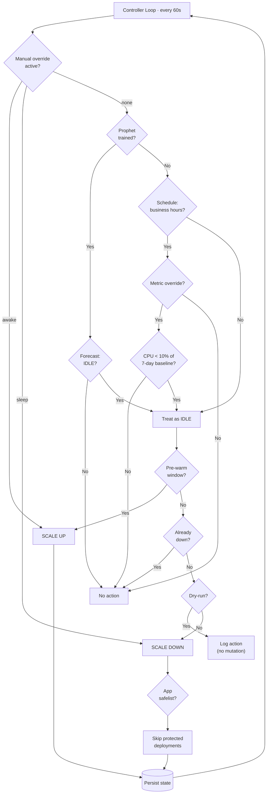
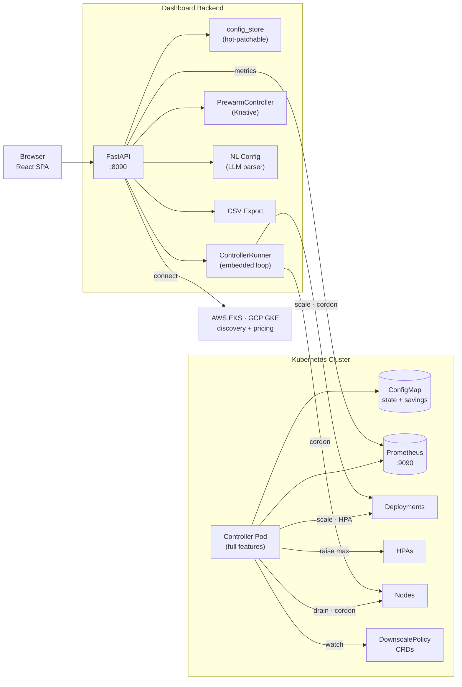

# Dynamic Predictive FinOps Cluster Down-Scaler — Technical Overview

> A production-grade Kubernetes FinOps operator that hibernates clusters on a learned schedule, predicts traffic with Facebook Prophet, and gives platform teams a real-time savings dashboard — saving up to 70% on non-production cloud spend.

---

## Engineering Highlights

| Area | What was built | Why it matters |
|:-----|:---------------|:---------------|
| **ML-driven scheduling** | Facebook Prophet trains on 4+ weeks of Prometheus CPU history, forecasts 48 hours ahead at 5-min resolution, and replaces the fixed clock with a learned idle gate | Demonstrates time-series ML in a production control loop with automatic retraining and graceful fallback |
| **Shared schedule engine** | Single `schedule.py` module provides idle detection and override resolution — both the embedded web-service runner and the full in-cluster controller delegate to it | Eliminates the "two brains" duplication; new schedule logic changes once |
| **Multi-layer decision engine** | Three-gate architecture: Prophet → schedule → metric override, evaluated every 60 seconds with shadow-mode logging | Shows defense-in-depth system design — each layer adds confidence without single points of failure |
| **Zero-downtime operations** | PDB-safe eviction, 5-minute drain timeout, HPA suspend/resume, pre-warm window, leader election via `coordination.k8s.io/v1` Lease | Production-safe Kubernetes orchestration — the controller never disrupts running workloads |
| **Real-time cost attribution** | Tracks each cordon/uncordon cycle against live AWS EC2 or GCP Compute Engine pricing with 1-hour cache; CSV export for finance | End-to-end FinOps pipeline from infrastructure event to dollar figure |
| **Predictive HPA synergy** | Prophet forecast detects incoming traffic spikes → proactively raises HPA `maxReplicas` before the surge → restores after | Bridges reactive autoscaling (HPA) with predictive capacity planning |
| **Cross-AZ spot migration** | Discovers low-priority workloads by label, compares spot pricing across AZs, migrates with interruption fallback | Multi-AZ cost optimization with automatic recovery on spot termination |
| **Knative AI pre-warm engine** | Detects user-intent signals (hover, focus, login) via embeddable JS SDK → fires async HTTP GET to Knative service → boots pod before inference request | Eliminates cold-start latency with 4-layer thrashing protection (confidence, debounce, cooldown, rate limit) |
| **Natural-language configuration** | Users type policies in plain English → LLM parses into config patches → diff preview → one-click apply | LLM tool-use integration with human-in-the-loop approval |
| **Custom Resource Definitions** | `DownscalePolicy` CRD lets operators define per-namespace/workload scaling policies in YAML, watched by the controller | Kubernetes-native declarative configuration — how real operators work |
| **Full-stack dashboard** | React 18 + TypeScript + Vite SPA with physics-based SVG topology, animated KPI tiles, Recharts time-series, Apple-dark design system; SSE with exponential-backoff reconnect drives real-time status; polling covers heavy data (history, capacity, events) | Production-quality frontend with real-time push, graceful reconnect, and responsive layout |
| **Modular API** | FastAPI backend split into 7 `APIRouter` modules (health, config, connect, controller, data, features, stream) with shared `deps.py` state | Clean separation of concerns; each router independently testable |
| **Persistent config** | `PATCH /api/config` changes auto-persist to a JSON file and survive process restarts; env vars bootstrap, runtime patches overlay | No lost settings after restarts — the operator behavior users configured stays configured |
| **Operational safety** | Dry-run mode, manual override (keep awake/force sleep with expiry), app safelist, onboarding wizard, shadow-mode logging | Trust-building features that let teams adopt incrementally |
| **Multi-cloud native** | AWS EKS (STS token auto-refresh every 13 min) + GCP GKE (OAuth2 service account) — cluster discovery, connect, and pricing from the browser | No kubeconfig wrangling — enter credentials, pick a cluster, done |

---

## Decision Algorithm



---

## System Architecture



**Two deployment modes:** web-service (browser-connected, embedded loop) and in-cluster (Helm, full controller with Prophet/HPA/CRDs/spot). The dashboard works with either.

---

## Tech Stack

| Layer | Technology | Purpose |
|:------|:-----------|:--------|
| **Controller** | Python 3.12, `kubernetes` client | 60s control loop, node management, deployment scaling, HPA suspend/resume, leader election |
| **ML** | Facebook Prophet, pandas | Time-series forecasting on Prometheus CPU history — weekly + daily seasonality |
| **Dashboard API** | FastAPI, uvicorn | 20+ REST routes split into 7 routers + SSE stream, React SPA serving |
| **Dashboard UI** | React 18, TypeScript, Vite | 4-page SPA: Controller (KPIs + topology + chart), Cluster (connect), Features (AI/ML toggles), Policies (CRDs) |
| **Visualization** | Recharts, custom SVG force graph | Time-series area chart with event markers; physics-based node topology with drag, CPU arcs, glow |
| **Cloud** | boto3, google-cloud-container, google-auth | EKS/GKE cluster discovery, kubeconfig generation, STS token refresh, spot pricing |
| **Persistence** | Kubernetes ConfigMap | Restart-safe state: replica counts, cordoned nodes, HPA originals, savings history |
| **Packaging** | Docker, Helm, docker-compose, Makefile | Demo, web-service, in-cluster, and dev paths |
| **CI** | GitHub Actions | ruff lint → pytest → Docker build |
| **Design** | Outfit + JetBrains Mono, CSS custom properties | Apple-dark aesthetic with kinetic animations and responsive 3-column grid |

---

## Key Metrics & Numbers

| Metric | Value |
|:-------|:------|
| Potential overnight savings | **Up to 70%** on non-production clusters |
| Controller loop interval | **60 seconds** |
| Prophet forecast horizon | **48 hours** at 5-min resolution |
| Prophet retraining | Every **6 hours** (configurable) |
| EKS token refresh | Every **13 minutes** (tokens expire at 15) |
| Pre-warm lead time | **15 minutes** default (configurable) |
| Knative pre-warm latency | **60s timeout** with 180s warm TTL cache |
| Pricing cache | **1-hour** TTL for AWS/GCP rates |
| Test coverage | **182 pytest tests** across 10 test modules |
| API surface | **20+ REST endpoints** |
| Frontend components | **16 React components** + 2 custom hooks |
| Backend modules | **12 Python modules** (controller) + **14 modules** (dashboard incl. 7 routers) |

---

## Prometheus Metrics Exposed

Controller exposes on `:8080/metrics`:

| Metric | Type | Description |
|:-------|:-----|:------------|
| `finops_scaledown_events_total` | Counter | Completed scale-down cycles |
| `finops_scaleup_events_total` | Counter | Completed scale-up cycles |
| `finops_deployments_scaled_total` | Counter | Deployments scaled (by namespace) |
| `finops_nodes_cordoned` | Gauge | Currently cordoned worker nodes |
| `finops_replicas_saved` | Gauge | Total original replicas held in state |
| `finops_controller_errors_total` | Counter | Unhandled control-loop exceptions |

---

## API Surface (selected)

| Method | Path | Purpose |
|:-------|:-----|:--------|
| `GET` | `/api/status` | Cluster hibernation state |
| `GET` | `/api/capacity` | Node CPU utilization + cordon status |
| `GET` | `/api/history?hours=` | CPU + capacity time-series + event markers |
| `GET` | `/api/savings` | Dollar savings (total / week / month / rate) |
| `GET` | `/api/events` | Cordon audit log with timestamps + cost |
| `GET` | `/api/savings/export` | **CSV download** for finance teams |
| `PATCH` | `/api/config` | Hot-patch any config field (immediate effect) |
| `POST` | `/api/connect/eks` | AWS EKS native connect |
| `POST` | `/api/connect/gke` | GCP GKE native connect |
| `POST` | `/api/controller/wake` | **Emergency scale-up** (bypass schedule) |
| `POST` | `/api/controller/sleep` | **Force scale-down** (bypass schedule) |
| `GET` | `/api/controller/dry-run-log` | What the controller *would* have done |
| `POST` | `/api/config/natural-language` | LLM config preview |
| `GET` | `/api/policies` | DownscalePolicy CRD listing |
| `GET` | `/api/prewarm/snippet` | Embeddable JS pre-warm SDK |
| `GET` | `/api/spot/status` | Spot migration dashboard data |
| `GET` | `/api/stream` | **SSE** real-time push (status + savings + controller) |

---

## Known Limitations

| Limitation | Detail | Mitigation |
|:-----------|:-------|:-----------|
| **Dashboard config ↔ in-cluster controller gap** | `PATCH /api/config` only reconfigures the embedded web-service loop. The full in-cluster `controller/main.py` reads env vars at startup and is unaware of runtime changes made via the UI. | Use in-cluster mode with env vars / Helm values for config; use web-service mode when live UI configuration is needed. |
| **Prophet trains on the main process** | Prophet retraining is CPU-bound and runs synchronously in the controller thread. Under heavy load this can delay ticks. | Future: run training in a `ProcessPoolExecutor`; accepted tradeoff for current scope. |
| **Spot migration is scaffolded, not battle-tested** | The spot migrator discovers candidates and logs actions but lacks end-to-end interruption signal handling. | Treat as "designed and demonstrated" rather than production-ready. |
| **Single static Bearer token** | Auth is all-or-nothing — one token for all write operations. No user roles or per-endpoint scopes. | Acceptable for single-operator use; upgrade path is an OIDC proxy. |

---

## Project Layout

```
DynaPredictingDownScaler/
├── controller/                     # In-cluster controller (full feature set)
│   ├── main.py                     # Control loop — _tick() every 60s
│   ├── predictor.py                # 3-layer gate: Prophet → schedule → metric override
│   ├── prophet_predictor.py        # Train on Prometheus, forecast 48h, cache & retrain
│   ├── scaler.py                   # Deployment scaling + HPA suspend/resume + spike prep
│   ├── node_manager.py             # Cordon · drain · uncordon (CPU + GPU aware)
│   ├── crd_watcher.py              # DownscalePolicy CRD watcher
│   ├── spot_migrator.py            # Cross-AZ spot instance migration
│   ├── auto_labeller.py            # Namespace annotation → deployment labelling
│   ├── state_store.py              # ConfigMap persistence
│   ├── leader_election.py          # coordination.k8s.io/v1 Lease
│   ├── preflight.py                # Startup validation (PASS/WARN/FAIL)
│   ├── k8s_events.py               # Native K8s Event emitter
│   ├── webhook.py                  # Slack-compatible notifier
│   ├── metrics.py                  # Prometheus HTTP client
│   ├── telemetry.py                # Self-expose finops_* on :8080
│   └── config.py                   # Env-var Config dataclass
├── dashboard/
│   ├── backend/
│   │   ├── app.py                  # FastAPI app — lifespan + router includes + SPA
│   │   ├── deps.py                 # Shared state (K8s reader, tracker, Prom helper)
│   │   ├── schedule.py             # Shared schedule evaluation (single source of truth)
│   │   ├── routers/
│   │   │   ├── health.py           # GET /health
│   │   │   ├── config.py           # Config CRUD + NL config (rate-limited)
│   │   │   ├── connect.py          # Kubeconfig / EKS / GKE connect
│   │   │   ├── controller.py       # Controller status, wake/sleep, dry-run log
│   │   │   ├── data.py             # Status, capacity, history, savings, CSV export
│   │   │   ├── features.py         # Prewarm, shadow log, HPA, policies, spot
│   │   │   └── stream.py           # SSE real-time push endpoint
│   │   ├── controller_runner.py    # Embedded loop + override + dry-run + safelist
│   │   ├── config_store.py         # Hot-patchable + file-persisted config
│   │   ├── prewarm.py              # Knative pre-warm engine
│   │   ├── nl_config.py            # LLM natural-language config parser
│   │   ├── cloud_providers.py      # EKS/GKE discovery + kubeconfig + STS
│   │   ├── pricing.py              # AWS/GCP/manual node cost (1h cache)
│   │   ├── savings_tracker.py      # Cordon-transition cost accumulator
│   │   └── auth.py                 # Bearer-token middleware
│   └── frontend/src/
│       ├── App.tsx                  # Polling, state, layout, page routing
│       ├── api.ts                   # Typed fetch helpers + interfaces
│       ├── hooks/
│       │   ├── usePrewarm.ts        # Frontend intent signal hook
│       │   └── useAnimatedValue.ts  # rAF easing for KPI numbers
│       └── components/
│           ├── OnboardingBanner.tsx  # 5-step guided setup wizard
│           ├── CommandBar.tsx        # Wake/Sleep + override + dry-run + export
│           ├── MetricsBar.tsx        # Animated savings KPI tiles
│           ├── NodeTopology.tsx      # Physics SVG force graph
│           ├── DemandCapacityChart.tsx # Recharts time-series + markers
│           ├── AuditLog.tsx          # Cordon event history
│           ├── FeaturesPage.tsx      # 3×2 AI/ML feature grid
│           ├── ClusterPage.tsx       # Cloud connect + config
│           ├── PoliciesPage.tsx      # CRD policy viewer
│           ├── SettingsPanel.tsx      # Settings drawer + safelist + webhook
│           ├── NLConfigBar.tsx       # Natural-language config chat
│           └── DashboardConfig.tsx   # Schedule strip
├── helm/finops-scaler/              # Helm chart (values + 7 templates)
├── manifests/                       # Raw K8s YAML + CRD definition
├── tests/                           # 182 pytest tests · 10 modules
├── docker-compose.yml               # Demo + full profiles
├── Makefile                         # make demo · dev · build · test
└── SETUP.md                         # Full installation guide
```

---

## Design Decisions

| Decision | Rationale |
|:---------|:----------|
| Schedule-first, ML-optional | Teams can start saving immediately with a fixed schedule; Prophet adds value only after 4 weeks of data |
| Label-gated scaling | `finops.io/scaledown-eligible=true` prevents accidental scale-down of critical workloads — explicit opt-in |
| Dry-run as default onboarding | New users see what would happen for a week before the controller touches anything |
| Embedded web-service loop | One Docker container connects to any cluster from the browser — no in-cluster install required for evaluation |
| ConfigMap state over etcd/DB | Zero external dependencies; state survives pod restarts without an operator database |
| Hot-patchable + persistent config | `PATCH /api/config` takes effect on the next tick AND auto-persists to disk — survives restarts without a database |
| Shared schedule module | `schedule.py` is the single source of truth — both deployment modes call the same functions | 
| Router-based API architecture | 7 `APIRouter` modules instead of a monolithic `app.py` — each router has one responsibility |
| SSE over polling | `/api/stream` pushes lightweight status via Server-Sent Events — one persistent connection replaces repeated HTTP round-trips |
| Rate-limited LLM endpoint | NL config route enforces a 5-second cooldown to prevent runaway OpenAI API costs |
| Rate-limited public prewarm | `/api/prewarm/signal` (unauthenticated SDK endpoint) enforces 10 req/10s per IP — prevents Knative ping saturation |
| Capped audit logs | Dry-run log uses `deque(maxlen=500)`, savings events use `deque(maxlen=500)` — bounded memory, no silent OOM |
| SSE auto-reconnect | Client reconnects with exponential backoff (1s → 30s) after server restarts or network drops |
| Shadow mode for Prophet | Logs predictions vs schedule agreement rate so teams build trust before switching from clock to ML |
| 4-layer pre-warm protection | Confidence floor → signal debounce → attempt cooldown → rate limit prevents thrashing on noisy UI events |
