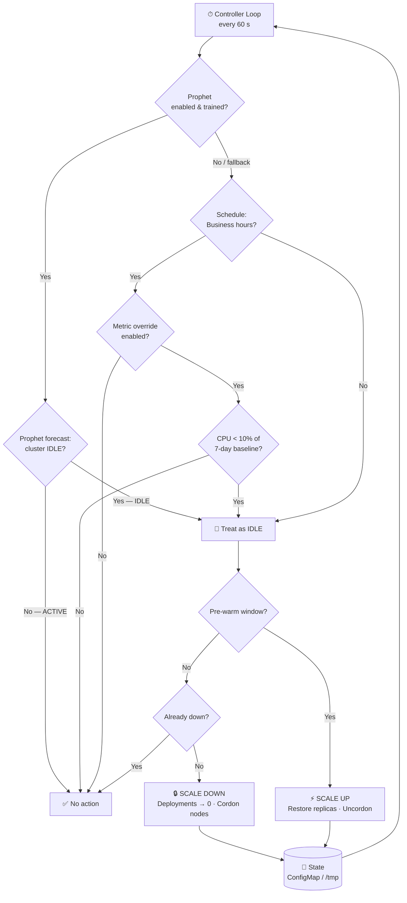
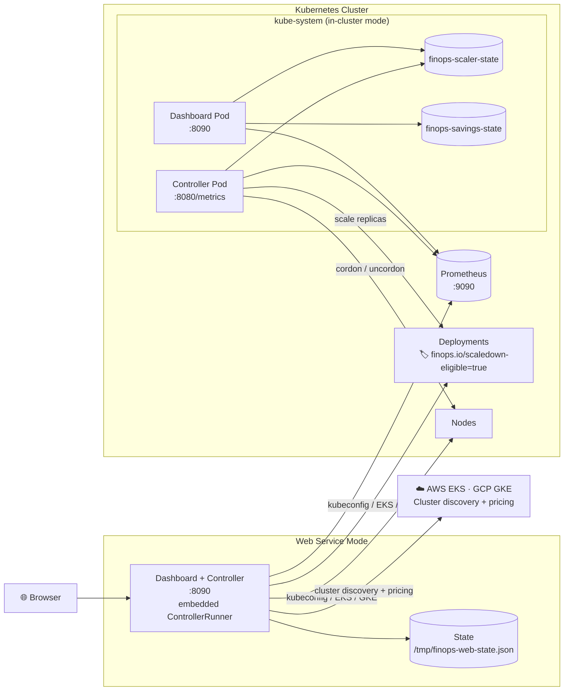

# Dynamic Predictive FinOps Cluster Down-Scaler

> Automatically hibernate your Kubernetes cluster during off-hours and wake it up before your team arrives.

---

## How It Works

Every 60 seconds the controller evaluates a three-layer gate:

1. **Prophet ML** (optional) — if trained, predicts whether the next window is idle based on weeks of Prometheus history
2. **Schedule** — timezone-aware business-hours window (Mon–Fri 07:00–19:00 by default)
3. **Metric override** (optional) — if live CPU drops below 10% of a 7-day rolling baseline mid-schedule, treat as idle (catches bank holidays automatically)

On idle: cordon non-CP nodes, scale labelled Deployments to 0, persist state.
On pre-warm (`PREWARM_MINUTES` before window opens): uncordon, restore replicas.

---

## Decision Algorithm



---

## System Architecture



---

## Use Cases

| Scenario | How it fires |
|:---------|:-------------|
| **Overnight & weekend savings** | Schedule exits business hours → cordon + scale to zero; pre-warm restores 15 min before morning |
| **Bank holidays / quiet days** | Metric override: CPU < 10% of 7-day baseline → scales down mid-schedule automatically |
| **ML-learned idle patterns** | Prophet trains on 4 weeks of Prometheus history, learns your actual quiet windows |
| **Staging only** | `NAMESPACE_FILTER=staging` — production untouched |
| **Dry-run audit** | `DRY_RUN=true` logs every decision without mutating anything |
| **Cost reporting** | `GET /api/savings` returns per-node, per-cordon dollar figures; `GET /api/events` gives line items |

---

## Tech Stack

| Layer | Technology | Role |
|:------|:-----------|:-----|
| **Controller** | Python 3.12 | Main loop, schedule/metric/Prophet gate, node + deployment management |
| | `kubernetes` client | Cordon · drain · uncordon · Deployment scaling · HPA suspend/resume |
| | `prophet` + `pandas` *(optional)* | Time-series ML on Prometheus CPU history |
| | `httpx` | Prometheus HTTP API client |
| **Dashboard backend** | FastAPI + uvicorn | 15 REST routes + React SPA serving |
| | `cloud_providers.py` | Native EKS cluster listing + kubeconfig generation (STS token); GKE cluster listing + OAuth2 kubeconfig |
| | `controller_runner.py` | Embedded scale/cordon loop; EKS STS token auto-refresh every 13 min |
| | `boto3` | AWS EKS API + EC2 pricing |
| | `google-cloud-container` | GKE cluster listing |
| | `google-auth` | GCP OAuth2 service account tokens |
| | `pricing.py` | AWS/GCP/manual node cost with 1-hour cache |
| **Dashboard frontend** | React 18 + TypeScript + Vite | Apple-dark SPA — Outfit + JetBrains Mono |
| | `ClusterPage.tsx` | Hero connection method (Kubeconfig/EKS/GKE), credentials drawer, schedule + controller config |
| | `NodeTopology.tsx` | Physics-based SVG force graph with drag, CPU arcs, glow effects |
| | Recharts | Demand vs capacity area chart with scale event markers |
| **Persistence** | Kubernetes ConfigMap | `finops-scaler-state` + `finops-savings-state` survive restarts |
| **CI** | GitHub Actions | ruff lint → pytest (168 tests) → Docker build |
| **Packaging** | Helm + Docker Compose + Makefile | Full install, demo, and dev paths |

---

## Prometheus Metrics Exposed

Controller self-exposes on `:8080/metrics`:

| Metric | Type | Description |
|:-------|:-----|:------------|
| `finops_scaledown_events_total` | Counter | Scale-down cycles |
| `finops_scaleup_events_total` | Counter | Scale-up cycles |
| `finops_deployments_scaled_total` | Counter | Deployments scaled (by namespace) |
| `finops_nodes_cordoned` | Gauge | Currently cordoned nodes |
| `finops_replicas_saved` | Gauge | Total replicas held in state |
| `finops_controller_errors_total` | Counter | Unhandled loop exceptions |

---

## Project Layout

```
DynaPredictingDownScaler/
├── controller/
│   ├── main.py              # Control loop · _tick() every 60 s
│   ├── predictor.py         # Schedule + metric-override + Prophet gate
│   ├── prophet_predictor.py # Train on Prometheus, forecast 48 h, cache 6 h
│   ├── scaler.py            # Deployment replicas + HPA suspend/resume
│   ├── auto_labeller.py     # Label Deployments in annotated namespaces
│   ├── node_manager.py      # Cordon · drain · uncordon
│   ├── state_store.py       # ConfigMap persistence
│   ├── metrics.py           # Prometheus HTTP client
│   ├── telemetry.py         # Expose finops_* metrics on :8080
│   ├── config.py            # Env-var Config dataclass
│   ├── preflight.py         # Startup PASS/WARN/FAIL checks
│   ├── k8s_events.py        # Native K8s Event emitter
│   ├── webhook.py           # Slack-compatible HTTP notifier
│   ├── leader_election.py   # coordination.k8s.io/v1 Lease
│   └── demo_stub.py         # Synthetic K8s + Prometheus stubs
├── dashboard/
│   ├── backend/
│   │   ├── app.py              # FastAPI · 15 routes
│   │   ├── cloud_providers.py  # EKS/GKE discovery · kubeconfig generation · STS token
│   │   ├── controller_runner.py# Embedded loop + EKS token refresh thread
│   │   ├── config_store.py     # Hot-patchable config singleton
│   │   ├── pricing.py          # AWS / GCP / manual node cost (1-hour cache)
│   │   ├── savings_tracker.py  # Cordon-transition cost accumulator
│   │   ├── k8s_client.py       # Read state + savings ConfigMaps
│   │   ├── demo_stub.py        # Synthetic data for demo mode
│   │   ├── prewarm.py          # Knative pre-warm engine (optional)
│   │   └── auth.py             # Bearer-token middleware
│   └── frontend/src/
│       ├── App.tsx                     # Polling · layout · page routing
│       ├── api.ts                      # Typed fetch helpers + all interfaces
│       └── components/
│           ├── ClusterPage.tsx         # Connection hero + creds drawer + config grid
│           ├── ConnectPanel.tsx        # Header drawer connection form
│           ├── DashboardConfig.tsx     # Schedule section on controller page
│           ├── NodeTopology.tsx        # Physics SVG force graph
│           ├── DemandCapacityChart.tsx # Recharts area chart + event markers
│           ├── MetricsBar.tsx          # Animated KPI tiles
│           ├── AuditLog.tsx            # Cordon event history table
│           ├── SettingsPanel.tsx       # Fine-tuning drawer
│           └── Toggle.tsx              # Accessible toggle switch
├── helm/finops-scaler/          # Helm chart
├── manifests/                   # Raw Kubernetes YAML
├── tests/                       # 168 pytest tests
├── docker-compose.yml
├── Makefile
└── .env.example
```
