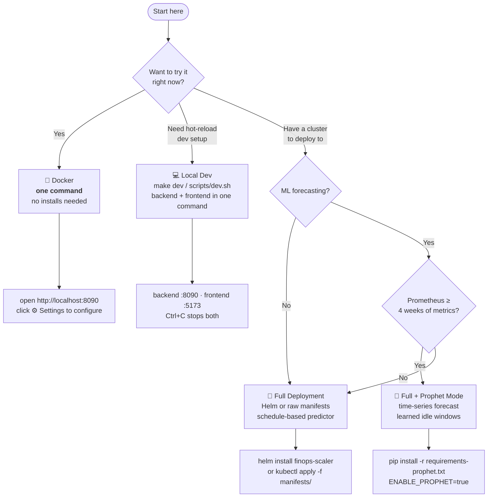
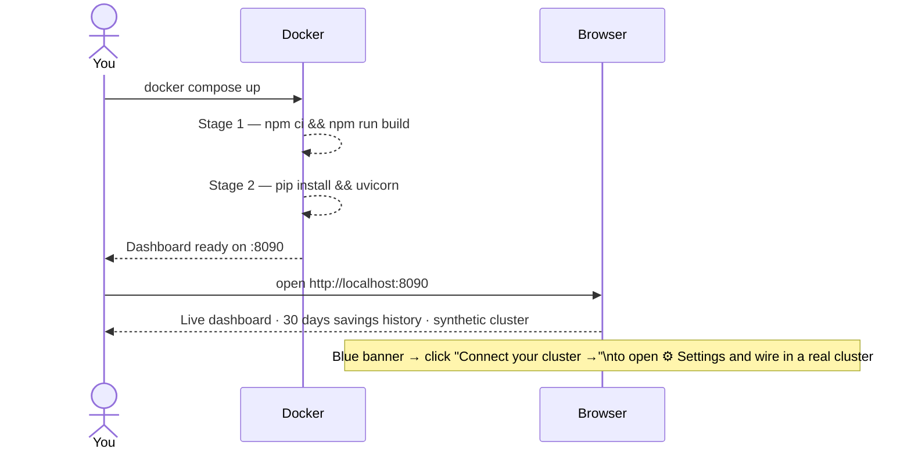
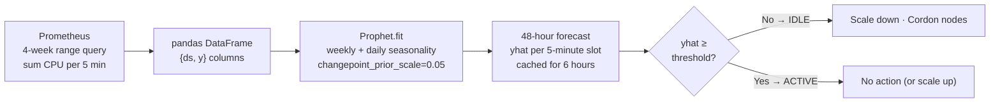
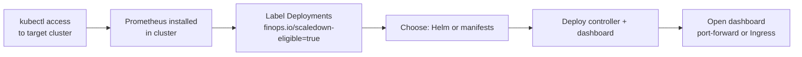
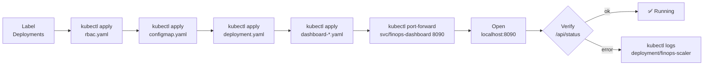

# Setup & Installation Guide

> Pick the path that matches where you are — from "I just want to see it" to "deploy to production with ML forecasting."

---

## Which path is right for you?



---

## Prerequisites

| Requirement | Docker | Local Dev | Full Deploy | Prophet |
|:-----------|:------:|:---------:|:-----------:|:-------:|
| Docker Desktop | ✅ | ❌ | ❌ | ❌ |
| Python 3.10+ | ❌ | ✅ | ✅ | ✅ |
| Node.js 18+ | ❌ | ✅ | ❌ optional | ❌ optional |
| Kubernetes cluster | ❌ | ❌ | ✅ | ✅ |
| Prometheus | ❌ | ❌ | ✅ | ✅ + 4-week retention |
| AWS/GCP account | ❌ | ❌ | optional | optional |

---

## 1 — Docker (fastest — one command)

> Run the full dashboard with synthetic data. **No Python, no Node.js, no Kubernetes, no Prometheus needed.**

```bash
git clone <repo-url>
cd DynaPredictingDownScaler
docker compose up          # or:  make demo
```

Open **http://localhost:8090**.

That's it. Docker builds a multi-stage image (Node 20-alpine compiles the React app; Python 3.12-slim runs FastAPI) and starts the dashboard in demo mode with pre-seeded synthetic cluster data.



### What demo mode shows

- A 3-node cluster (`demo-node-1/2/3`) with realistic CPU patterns — ~9.5 cores active Mon–Fri 07:00–19:00, ~0.4 cores off-hours
- 2 eligible deployments (`api-server ×3`, `worker ×5`) scaled to zero off-hours
- 30 days of pre-seeded savings history ($847.52 base)
- Scale-down ▼ and scale-up ▲ markers on the history chart at each business-hours crossing

### Stop

```bash
docker compose down        # or:  make stop
```

### Verify the API

```bash
curl http://localhost:8090/health        # {"status":"ok"}
curl http://localhost:8090/api/status    # cluster state JSON
curl http://localhost:8090/api/savings   # cost savings JSON
curl "http://localhost:8090/api/history?hours=24"
```

---

## 2 — Local Dev (hot-reload, one command)

> Both backend and frontend start together, with live-reload. No Docker needed, but requires Python 3.10+ and Node 18+.

**macOS / Linux:**

```bash
make dev
# → installs pip + npm deps if missing
# → backend  http://localhost:8090  (FastAPI, auto-reloads on .py save)
# → frontend http://localhost:5173  (Vite HMR)
# → Ctrl+C stops both cleanly
```

**Windows (PowerShell):**

```powershell
make dev-win
# Opens backend and frontend each in their own PowerShell window.
# Press Enter in the launch window to stop both.
```

**Without make:**

```bash
bash scripts/dev.sh          # macOS/Linux
# or
powershell -ExecutionPolicy Bypass -File scripts/dev.ps1   # Windows
```

The Vite dev server proxies all `/api/*` and `/health` requests to `localhost:8090` automatically — no CORS configuration needed.

---

## 3 — Configuring via the Settings UI

> No env var editing, no YAML, no restarts. All runtime settings are available in the browser.

Once the dashboard is open (whether via Docker or local dev), click **⚙ Settings** in the top-right of the header. A panel slides in from the right with five sections:

| Section | What you configure |
|:--------|:------------|
| 🔌 **Connection** | Toggle demo mode on/off · Prometheus URL |
| ☁️ **Cloud & Pricing** | Cloud provider (Manual / AWS / GCP) · instance type · region · hourly rate |
| 🗓 **Schedule** | Business hours · active days (pill buttons) · timezone · pre-warm minutes |
| 🔮 **Prediction** | Metric override · Prophet ML on/off · training weeks · idle threshold · retrain interval |
| 📊 **Dashboard** | Poll interval · node utilisation threshold · namespace filter · min replica floor |

Click **Save Changes** — the backend accepts the update, invalidates pricing caches if needed, and the dashboard refreshes data immediately.

> **When to use env vars instead:** For Kubernetes/Helm deployments where configuration must be baked into the pod spec at deploy time, use environment variables or `values.yaml`. The Settings UI is for live tuning — both approaches can coexist.

---

## 4 — Prophet ML Mode

> Prophet trains a time-series model on your cluster's Prometheus history and **learns your actual idle patterns** — handling bank holidays, quiet Fridays, and irregular demand automatically.

### How Prophet fits in



### Install

```bash
pip install -r requirements-prophet.txt
# Installs: prophet>=1.1.5, pandas>=2.0.0
# First install takes ~2–5 minutes (Stan compilation)
```

### Configure

Either in the **⚙ Settings → Prediction** section of the UI, or via environment variables:

| Variable | Default | Description |
|:---------|:--------|:------------|
| `ENABLE_PROPHET` | `false` | Set to `true` to activate |
| `PROPHET_TRAINING_WEEKS` | `4` | Weeks of Prometheus history to train on |
| `PROPHET_IDLE_THRESHOLD_CORES` | `0.5` | yhat below this → cluster is idle |
| `PROPHET_RETRAIN_HOURS` | `6` | Retrain model every N hours |

### Run

```bash
# macOS / Linux
ENABLE_PROPHET=true PROMETHEUS_URL=http://localhost:9090 python -m controller.main

# Windows PowerShell
$env:ENABLE_PROPHET="true"; $env:PROMETHEUS_URL="http://localhost:9090"
python -m controller.main
```

### Expected logs

```
INFO  Prophet model trained on 8064 data points covering 4 weeks; forecast cached for 6 hours
INFO  Prophet predicts cluster IDLE at 2026-05-22 19:05:00+00:00
INFO  Entering low-activity window — scaling down eligible deployments
```

### Graceful fallback

If training fails for any reason (network issue, insufficient data, missing package), the controller **automatically falls back to the schedule predictor** without crashing. You'll see a `WARNING` in the logs explaining why.

### Threshold tuning

- Prophet marks too many hours as idle → raise `PROPHET_IDLE_THRESHOLD_CORES` (e.g. `2.0`)
- Prophet never triggers → lower it (e.g. `0.3`)
- "only N data points" → Prometheus doesn't have enough history yet; Prophet falls back automatically until ≥ 24 data points are available

---

## 5 — Full Cluster Deployment

### Prerequisites



### Label your workloads

Only Deployments with this label are eligible for scale-down. You have two options:

**Option A — label individual Deployments:**

```bash
kubectl label deployment my-api    finops.io/scaledown-eligible=true
kubectl label deployment my-worker finops.io/scaledown-eligible=true

# Verify:
kubectl get deployments -A -l finops.io/scaledown-eligible=true
```

**Option B — opt in a whole namespace (auto-labeller, recommended for new clusters):**

```bash
# Enable auto-labeller in values.yaml or configmap:
#   ENABLE_AUTO_LABEL=true  (default: false)

# Then annotate the namespace — the controller labels every Deployment in it each tick:
kubectl annotate namespace staging finops.io/scaledown-namespace=true
kubectl annotate namespace dev     finops.io/scaledown-namespace=true

# Production namespace left unannotated → never touched
```

The auto-labeller is idempotent — it skips Deployments that already carry the label. New Deployments added to an annotated namespace are picked up automatically on the next tick.

### Deploy via Helm (recommended)

```bash
helm install finops-scaler ./helm/finops-scaler \
  --set config.prometheusUrl=http://prometheus-operated.monitoring.svc.cluster.local:9090 \
  --set config.timezone=America/New_York \
  --set config.businessHoursStart=08:00 \
  --set config.businessHoursEnd=18:00

# Optional: enable Prophet ML forecasting
helm upgrade finops-scaler ./helm/finops-scaler \
  --set config.enableProphet=true \
  --set config.prophetIdleThresholdCores=1.0

# Optional: auto-label all Deployments in annotated namespaces
helm upgrade finops-scaler ./helm/finops-scaler \
  --set config.enableAutoLabel=true

# Optional: disable HPA suspend (if you manage HPAs separately)
helm upgrade finops-scaler ./helm/finops-scaler \
  --set config.enableHpaSuspend=false

# Optional: demo mode for testing the chart without a real cluster
helm upgrade finops-scaler ./helm/finops-scaler \
  --set config.demoMode=true
```

### Deploy via raw manifests

```bash
# Edit manifests/configmap.yaml with your PROMETHEUS_URL and TIMEZONE first

kubectl apply -f manifests/rbac.yaml
kubectl apply -f manifests/configmap.yaml
kubectl apply -f manifests/deployment.yaml

kubectl apply -f manifests/dashboard-rbac.yaml
kubectl apply -f manifests/dashboard-configmap.yaml
kubectl apply -f manifests/dashboard-deployment.yaml
kubectl apply -f manifests/dashboard-service.yaml
```

### Verify

```bash
# Controller logs
kubectl logs -f deployment/finops-scaler -n kube-system

# Dashboard
kubectl port-forward svc/finops-dashboard 8090:8090 -n kube-system
# → open http://localhost:8090

# API health checks
curl http://localhost:8090/health           # {"status":"ok"}
curl http://localhost:8090/api/status       # cluster state (cordoned nodes, scaled deployments)
curl http://localhost:8090/api/config       # live configuration
curl http://localhost:8090/api/savings      # accumulated cost savings
curl http://localhost:8090/api/events       # audit log — cordon/uncordon history
```

### Full deployment sequence



---

## 6 — Dry-Run (recommended before go-live)

Run for a week before enabling live mutations to validate that scheduling decisions match your expectations:

```bash
# Helm
helm upgrade finops-scaler ./helm/finops-scaler --set config.dryRun=true

# Raw manifests — edit configmap.yaml → DRY_RUN: "true"
kubectl apply -f manifests/configmap.yaml
kubectl rollout restart deployment/finops-scaler -n kube-system

# Watch decisions
kubectl logs -f deployment/finops-scaler -n kube-system | grep -E "DRY-RUN|low-activity|Restoring"
```

Expected output:
```
[DRY-RUN] Would set default/api-server replicas → 0
[DRY-RUN] Would cordon node-2
[DRY-RUN] Would drain node-2
```

---

## 7 — Run the controller locally (demo mode)

The controller also runs locally without any cluster — useful for testing schedule logic or Prophet tuning:

```bash
# macOS / Linux
DEMO_MODE=true DRY_RUN=true python -m controller.main

# Windows PowerShell
$env:DEMO_MODE="true"; $env:DRY_RUN="true"; python -m controller.main
```

Expected output:
```
INFO  controller.main  Controller started (loop=60s, demo=True, prophet=False, recovered=False)
INFO  controller.main  Entering low-activity window — scaling down eligible deployments
INFO  controller.demo_stub  [DEMO] Scaled default/api-server → 0 replicas
INFO  controller.demo_stub  [DEMO] Cordoned demo-node-2
```

---

## Makefile reference

```bash
make demo      # docker compose up, demo mode → http://localhost:8090
make full      # docker compose --profile full up (dashboard + controller)
make dev       # hot-reload local dev, backend :8090 + frontend :5173 (macOS/Linux)
make dev-win   # same, Windows PowerShell
make build     # npm ci + npm run build (production frontend bundle)
make test      # pytest tests/ -v
make stop      # docker compose down
make logs      # docker compose logs -f
make clean     # remove containers, images, and dist/
```

---

## Configuration Reference

### Schedule

| Variable | Default | Description |
|:---------|:--------|:------------|
| `BUSINESS_HOURS_START` | `07:00` | Active window start (HH:MM) |
| `BUSINESS_HOURS_END` | `19:00` | Active window end (HH:MM) |
| `BUSINESS_DAYS` | `0,1,2,3,4` | Active weekdays (0=Mon…6=Sun) |
| `TIMEZONE` | `UTC` | IANA timezone (e.g. `America/New_York`) |
| `PREWARM_MINUTES` | `15` | Scale-up lead time before window start |

### Scaling

| Variable | Default | Description |
|:---------|:--------|:------------|
| `MIN_REPLICA_FLOOR` | `0` | Floor replicas during scale-down |
| `NODE_UTILISATION_THRESHOLD` | `0.10` | Cordon nodes below this CPU fraction |
| `NAMESPACE_FILTER` | *(all)* | Restrict to one namespace |
| `ENABLE_METRIC_OVERRIDE` | `false` | Quiet-day detection via Prometheus baseline |
| `ENABLE_HPA_SUSPEND` | `true` | Patch HPA `minReplicas: 0` during scale-down; restored on scale-up |
| `ENABLE_AUTO_LABEL` | `false` | Label Deployments in namespaces annotated `finops.io/scaledown-namespace=true` |

### Operations

| Variable | Default | Description |
|:---------|:--------|:------------|
| `DRY_RUN` | `false` | Log all mutations, apply none |
| `DEMO_MODE` | `false` | Synthetic data, no cluster needed |
| `LOOP_INTERVAL_SECONDS` | `60` | Controller poll cadence |
| `METRICS_PORT` | `8080` | Prometheus scrape port |

### Prophet

| Variable | Default | Description |
|:---------|:--------|:------------|
| `ENABLE_PROPHET` | `false` | Activate ML forecasting |
| `PROPHET_TRAINING_WEEKS` | `4` | Training window length |
| `PROPHET_IDLE_THRESHOLD_CORES` | `0.5` | yhat below this = idle |
| `PROPHET_RETRAIN_HOURS` | `6` | Model refresh interval |

### Dashboard / Pricing

| Variable | Default | Description |
|:---------|:--------|:------------|
| `CLOUD_PROVIDER` | `manual` | `aws` · `gcp` · `manual` |
| `NODE_INSTANCE_TYPE` | — | e.g. `m5.xlarge`, `n2-standard-4` |
| `AWS_REGION` | — | e.g. `us-east-1` |
| `NODE_HOURLY_COST` | `0.192` | Fallback rate (USD/hr per node) |

> All of the above can also be set live via **⚙ Settings** in the dashboard — changes take effect without a restart.

---

## Troubleshooting

### Dashboard shows no data

```bash
curl http://localhost:8090/health      # → {"status":"ok"}
curl http://localhost:8090/api/status  # → JSON with cluster state
```

If health returns an error, the backend isn't running. If the frontend shows a connection banner, verify the backend is on port `8090` and the frontend dev server is on `5173`.

### "Prophet not installed" warning

```bash
pip install -r requirements-prophet.txt
# If Stan compilation fails on Linux:
sudo apt-get install -y build-essential
pip install pystan==3.8.0 prophet
```

### Controller pod CrashLoopBackOff

```bash
kubectl logs deployment/finops-scaler -n kube-system --previous
```

Common causes:
- **RBAC** — verify ClusterRole binding: `kubectl get clusterrolebinding finops-scaler`
- **Prometheus unreachable** — controller logs `Cannot fetch node CPU metrics`; check `PROMETHEUS_URL`
- **No business days** — `BUSINESS_DAYS` must be a non-empty comma-separated list

### Dashboard shows $0.00 savings

The savings tracker needs the controller to have completed at least one full cordon → uncordon cycle. Fresh deployments accumulate from the first event. Use demo mode to see pre-seeded history immediately.

### Prophet predicts active when cluster is idle

Lower `PROPHET_IDLE_THRESHOLD_CORES`. For a cluster idling at ~0.3 cores total:

```bash
PROPHET_IDLE_THRESHOLD_CORES=0.3
```

Or set it live via **⚙ Settings → Prediction → Idle Threshold**.

---

## What's next

- **Grafana** — scrape the `finops_*` metrics from `:8080/metrics` for historical trend dashboards
- **Slack/Teams alerts** — pipe `GET /api/savings` into a weekly digest CronJob; `GET /api/events` gives per-cordon line items
- **Namespace scoping** — `NAMESPACE_FILTER=staging` to trial on test environments first, or use `ENABLE_AUTO_LABEL=true` to opt entire namespaces in via annotation
- **Prophet tuning** — lower `PROPHET_IDLE_THRESHOLD_CORES` if the cluster idles at < 0.5 cores; raise it if Prophet is too aggressive
- **HPA co-existence** — `ENABLE_HPA_SUSPEND=true` (default) ensures HPAs don't fight scale-down; set to `false` only if you manage HPA minReplicas yourself during off-hours
