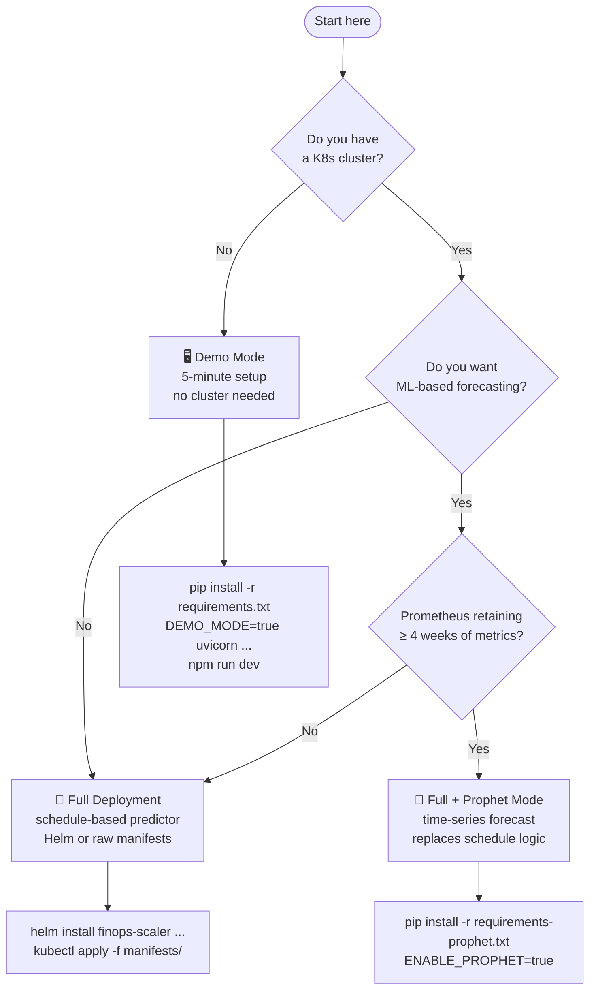
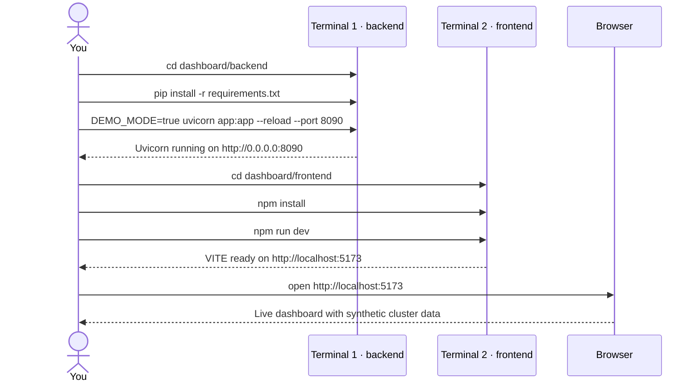
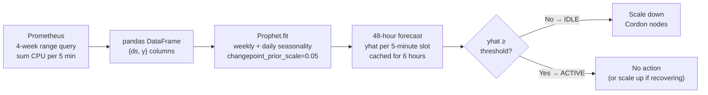
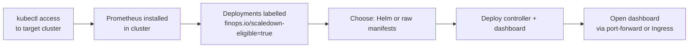
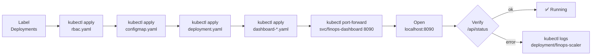

# Setup & Installation Guide

> Three paths to running the FinOps Down-Scaler — pick the one that matches where you are today.

---

## Which path is right for you?



---

## Prerequisites

| Requirement | Demo Mode | Full Deployment | Prophet Mode |
|:-----------|:---------:|:---------------:|:------------:|
| Python 3.10+ | ✅ | ✅ | ✅ |
| Node.js 18+ | ✅ | optional | optional |
| Kubernetes cluster | ❌ not needed | ✅ | ✅ |
| Prometheus | ❌ not needed | ✅ | ✅ + 4-week retention |
| AWS/GCP account | ❌ not needed | optional | optional |

---

## 1 — Demo Mode

> Run the full dashboard with **synthetic data** — no Kubernetes, no Prometheus, no cloud account. Ideal for evaluating the UI and understanding the system before deploying.

### What demo mode simulates

- A 3-node cluster (`demo-node-1`, `demo-node-2`, `demo-node-3`)
- Realistic CPU usage: ~9.5 cores active during business hours (Mon–Fri 07:00–19:00), ~0.4 cores at night
- 2 eligible deployments (`api-server ×3`, `worker ×5`) that scale to zero off-hours
- ~30 days of pre-seeded savings history ($847.52 base)
- Scale-down/up events visible on the chart at each daily business-hours crossing

### Step-by-step



#### Terminal 1 — backend

```bash
cd dashboard/backend
pip install -r requirements.txt

# macOS / Linux
DEMO_MODE=true uvicorn app:app --reload --port 8090

# Windows PowerShell
$env:DEMO_MODE="true"; uvicorn app:app --reload --port 8090
```

#### Terminal 2 — frontend dev server

```bash
cd dashboard/frontend
npm install
npm run dev
# → open http://localhost:5173
```

> **Tip:** The frontend dev server proxies `/api/*` to `localhost:8090` automatically — no CORS or config needed.

### Verify the API directly

```bash
curl http://localhost:8090/api/status
curl http://localhost:8090/api/savings
curl "http://localhost:8090/api/history?hours=24"
curl http://localhost:8090/api/capacity
```

### Run the controller in demo mode (optional)

The controller can also run locally — it will log scale-down/up decisions without touching any real cluster:

```bash
# From the project root
pip install -r requirements.txt

# macOS / Linux
DEMO_MODE=true DRY_RUN=true python -m controller.main

# Windows PowerShell
$env:DEMO_MODE="true"; $env:DRY_RUN="true"; python -m controller.main
```

Expected output:
```
2026-05-22T19:00:00 INFO     controller.main  Controller started (loop=60s, demo=True, prophet=False, recovered=False)
2026-05-22T19:00:00 INFO     controller.main  Entering low-activity window — scaling down eligible deployments
2026-05-22T19:00:00 INFO     controller.demo_stub  [DEMO] Scaled default/api-server → 0 replicas
2026-05-22T19:00:00 INFO     controller.demo_stub  [DEMO] Cordoned demo-node-2
```

---

## 2 — Prophet Mode

> Prophet trains a time-series model on your cluster's historical CPU usage and **learns your actual patterns** — handling bank holidays, quiet Fridays, and irregular demand without manual schedule tweaking.

### How Prophet fits in



### Additional prerequisites

```bash
pip install -r requirements-prophet.txt
# Installs: prophet>=1.1.5, pandas>=2.0.0
# Note: Prophet depends on pystan or cmdstanpy — first install takes ~2-5 minutes
```

### Configuration

| Variable | Default | Description |
|:---------|:--------|:------------|
| `ENABLE_PROPHET` | `false` | Set to `true` to activate |
| `PROPHET_TRAINING_WEEKS` | `4` | Weeks of Prometheus history to train on |
| `PROPHET_IDLE_THRESHOLD_CORES` | `0.5` | yhat below this → cluster is idle |
| `PROPHET_RETRAIN_HOURS` | `6` | Retrain model every N hours |

### Run with Prophet

```bash
# macOS / Linux
ENABLE_PROPHET=true \
PROMETHEUS_URL=http://localhost:9090 \
python -m controller.main

# Windows PowerShell
$env:ENABLE_PROPHET="true"
$env:PROMETHEUS_URL="http://localhost:9090"
python -m controller.main
```

### Expected log output

```
INFO  Prophet model trained on 8064 data points covering 4 weeks; forecast cached for 6 hours
INFO  Prophet predicts cluster IDLE at 2026-05-22 19:05:00+00:00
INFO  Entering low-activity window — scaling down eligible deployments
```

### What to watch for

- **"Prophet not installed"** → run `pip install -r requirements-prophet.txt`
- **"only N data points"** → Prometheus doesn't have enough history yet; Prophet falls back to the schedule predictor automatically until ≥ 24 data points are available
- **Threshold tuning** — if Prophet marks too many hours as idle, raise `PROPHET_IDLE_THRESHOLD_CORES` (e.g., `2.0`); if it never triggers, lower it

### Graceful fallback

If Prophet training fails for any reason (network issue, insufficient data, import error), the controller automatically falls back to the schedule-based predictor without crashing. You'll see a `WARNING` log explaining why.

---

## 3 — Full Cluster Deployment

### Prerequisites



### Label your workloads

Only Deployments with this label are eligible for scale-down:

```bash
kubectl label deployment my-api      finops.io/scaledown-eligible=true
kubectl label deployment my-worker   finops.io/scaledown-eligible=true
# Verify:
kubectl get deployments -A -l finops.io/scaledown-eligible=true
```

### Deploy via Helm (recommended)

```bash
helm install finops-scaler ./helm/finops-scaler \
  --set config.prometheusUrl=http://prometheus-operated.monitoring.svc.cluster.local:9090 \
  --set config.timezone=America/New_York \
  --set config.businessHoursStart=08:00 \
  --set config.businessHoursEnd=18:00

# Optional: enable Prophet
helm upgrade finops-scaler ./helm/finops-scaler \
  --set config.enableProphet=true \
  --set config.prophetIdleThresholdCores=1.0
```

### Deploy via raw manifests

```bash
# Edit manifests/configmap.yaml with your PROMETHEUS_URL and TIMEZONE first

kubectl apply -f manifests/rbac.yaml
kubectl apply -f manifests/configmap.yaml
kubectl apply -f manifests/deployment.yaml

kubectl apply -f manifests/dashboard-rbac.yaml
kubectl apply -f manifests/dashboard-configmap.yaml
kubectl apply -f manifests/dashboard-deployment.yaml
kubectl apply -f manifests/dashboard-service.yaml
```

### Verify

```bash
# Controller logs
kubectl logs -f deployment/finops-scaler -n kube-system

# Dashboard
kubectl port-forward svc/finops-dashboard 8090:8090 -n kube-system
# → open http://localhost:8090

# API health
curl http://localhost:8090/health
curl http://localhost:8090/api/status
```

### Full deployment sequence



---

## 4 — Dry-Run (recommended before go-live)

Run for a week before enabling live mutations to validate the scheduling decisions match your expectations:

```bash
# Edit manifests/configmap.yaml → DRY_RUN: "true"
kubectl apply -f manifests/configmap.yaml
kubectl rollout restart deployment/finops-scaler -n kube-system

# Watch decisions
kubectl logs -f deployment/finops-scaler -n kube-system | grep -E "DRY-RUN|low-activity|Restoring"
```

Expected dry-run output:
```
[DRY-RUN] Would set default/api-server replicas → 0
[DRY-RUN] Would cordon node-2
[DRY-RUN] Would drain node-2
```

---

## Configuration Reference

### Schedule

| Variable | Default | Description |
|:---------|:--------|:------------|
| `BUSINESS_HOURS_START` | `07:00` | Active window start (HH:MM) |
| `BUSINESS_HOURS_END` | `19:00` | Active window end (HH:MM) |
| `BUSINESS_DAYS` | `0,1,2,3,4` | Active weekdays (0=Mon…6=Sun) |
| `TIMEZONE` | `UTC` | IANA timezone (e.g. `America/New_York`) |
| `PREWARM_MINUTES` | `15` | Scale-up lead time before window start |

### Scaling

| Variable | Default | Description |
|:---------|:--------|:------------|
| `MIN_REPLICA_FLOOR` | `0` | Floor replicas during scale-down |
| `NODE_UTILISATION_THRESHOLD` | `0.10` | Cordon nodes below this CPU fraction |
| `NAMESPACE_FILTER` | *(all)* | Restrict to one namespace |
| `ENABLE_METRIC_OVERRIDE` | `false` | Quiet-day detection via Prometheus baseline |

### Operations

| Variable | Default | Description |
|:---------|:--------|:------------|
| `DRY_RUN` | `false` | Log all mutations, apply none |
| `DEMO_MODE` | `false` | Synthetic data, no cluster needed |
| `LOOP_INTERVAL_SECONDS` | `60` | Controller poll cadence |
| `METRICS_PORT` | `8080` | Prometheus scrape port |

### Prophet

| Variable | Default | Description |
|:---------|:--------|:------------|
| `ENABLE_PROPHET` | `false` | Activate ML forecasting |
| `PROPHET_TRAINING_WEEKS` | `4` | Training window length |
| `PROPHET_IDLE_THRESHOLD_CORES` | `0.5` | yhat below this = idle |
| `PROPHET_RETRAIN_HOURS` | `6` | Model refresh interval |

### Dashboard / Pricing

| Variable | Default | Description |
|:---------|:--------|:------------|
| `CLOUD_PROVIDER` | `manual` | `aws` · `gcp` · `manual` |
| `NODE_INSTANCE_TYPE` | — | e.g. `m5.xlarge`, `n2-standard-4` |
| `AWS_REGION` | — | e.g. `us-east-1` |
| `NODE_HOURLY_COST` | `0.192` | Fallback rate (USD/hr per node) |

---

## Troubleshooting

### Demo mode: dashboard shows no data

Check that the backend started successfully:
```bash
curl http://localhost:8090/health     # should return {"status":"ok"}
curl http://localhost:8090/api/status # should return JSON with demo data
```

If the frontend shows a connection error banner, verify the Vite proxy is working — the dev server must be running on port `5173` and the backend on port `8090`.

### "Prophet not installed" warning

```bash
pip install -r requirements-prophet.txt
# If Stan compilation fails on Linux:
sudo apt-get install -y build-essential
pip install pystan==3.8.0
pip install prophet
```

### Controller pod CrashLoopBackOff

```bash
kubectl logs deployment/finops-scaler -n kube-system --previous
```

Common causes:
- **RBAC** — verify `finops-scaler` ServiceAccount has ClusterRole binding: `kubectl get clusterrolebinding finops-scaler`
- **Prometheus unreachable** — the controller logs `Cannot fetch node CPU metrics`; check the `PROMETHEUS_URL` env var
- **No business days configured** — `BUSINESS_DAYS` must be a non-empty comma-separated list

### Dashboard shows $0.00 savings

The savings tracker needs the controller to have completed at least one cordon/uncordon cycle. In a fresh deployment, savings accumulate from the first successful scale-down event. Use the demo mode to see pre-seeded savings data immediately.

### Prophet predicts active when cluster is idle

Lower `PROPHET_IDLE_THRESHOLD_CORES`. For a cluster that idles at ~0.3 cores total, set:
```bash
PROPHET_IDLE_THRESHOLD_CORES=0.4
```

---

## What's next

- **Metrics** — Prometheus scrapes `http://<controller-pod>:8080/metrics` for `finops_*` counters and gauges
- **Grafana** — import the exported `finops_*` metrics into a Grafana dashboard for historical trend analysis
- **Slack/Teams alerts** — pipe `GET /api/savings` into a weekly digest via a CronJob
- **Custom schedules** — set `NAMESPACE_FILTER=staging` to scope down to test environments only
